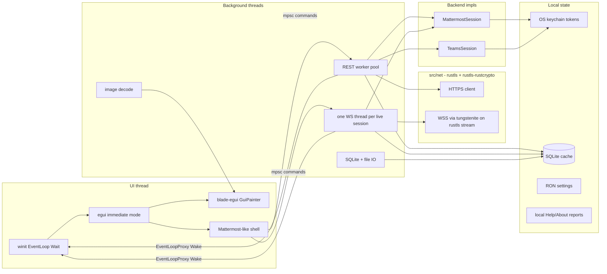
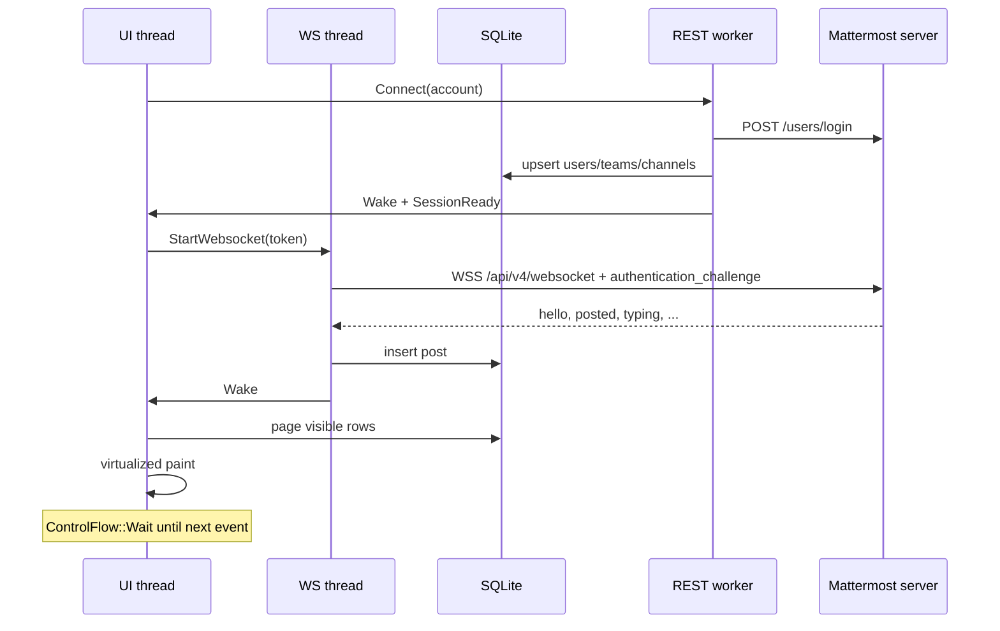

# ComPort — Native Chat Client Design

| Field | Value |
| --- | --- |
| **Title** | ComPort: a native Mattermost + Microsoft Teams desktop client |
| **Author** | navigato-rs (Dzmitry Malyshau) |
| **Date** | 2026-09-20 |
| **Status** | Draft |
| **Crate policy** | One package per repo. No in-repo library crates. Share only via dedicated repos. |
| **Repo** | https://github.com/navigato-rs/comport (`/x/Code/comport`) |
| **License** | MIT (Copyright 2026 navigato-rs) |
| **Audience** | Senior engineers implementing from a greenfield tree |

---

## Overview

ComPort is the third [navigato-rs](https://github.com/navigato-rs) desktop application: a **native** chat client, not a webview wrapper of Mattermost or Microsoft Teams. The cover version implements two backends — **Mattermost** (visual and interaction reference) and **Microsoft Teams** (Graph-backed, mapped into the same shell) — with a protocol-agnostic core, a local message cache, and the same Blade + egui + winit stack as FileMan and Starcom.

The empty checkout currently contains only `README.md` (`# ComPort` / `Mattermost communication portal`), an MIT `LICENSE`, and a Cargo-style `.gitignore`. There is no `Cargo.toml` and no `src/`. This document is the implementation spec for that tree.

Product priorities, in order: **minimalism**, **quick response**, **low battery**. The official Mattermost web/desktop layout (team bar, categorized channel sidebar, center pane, optional RHS, Ctrl+K switcher) is the v1 look. Teams is a second backend behind the same traits; where Graph cannot support Mattermost behavior, ComPort shows the gap rather than faking it.

---

## Background & Motivation

### Why a native client

Official Mattermost Desktop is an Electron shell around the web app. Microsoft Teams is a Chromium-class desktop. Both keep a GPU compositor and a JS runtime warm, which is the opposite of navigato-rs goals (see Starcom `PLAN.md` idle-CPU priority and FileMan’s `ControlFlow::Wait` event loop).

A native client can:

- Idle the GPU (`winit::event_loop::ControlFlow::Wait` / `WaitUntil`) instead of polling at display refresh.
- Render only visible message rows (egui virtualization), decode images off-thread, and bound texture caches — FileMan already does this for previews (`MAX_IMAGE_TEXTURES = 64`, `MAX_IMAGE_UPLOADS_PER_FRAME = 2` in `fileman/src/main.rs`).
- Cache history locally so startup is a disk read plus a WebSocket, not a full SPA bootstrap.
- Store tokens in the OS keychain and never phone home (FileMan/Starcom `PRIVACY.md`).

### Current state of this repo

`/x/Code/comport` is a greenfield MIT repo (`a01f522 Initial commit`) with remote `https://github.com/navigato-rs/comport`. Implementation starts from sibling conventions, not from a fork of Mattermost Desktop.

### Sibling apps (must stay aligned)

| App | Role | Stack facts used here |
| --- | --- | --- |
| [FileMan](https://github.com/navigato-rs/fileman) | Two-panel file manager | Workspace crates `navigato-support`, `navigato-http`. Edition 2024, rust-version **1.95**. Blade `git = "https://github.com/kvark/blade"` rev **`f1fbf2a`**, egui/egui-winit **0.34**, winit **0.30.5**. External themes in `themes/` (JSON/YAML/TOML). Worker threads + `EventLoopProxy<UserEvent::Wake>`. Packaging deb/rpm/AppImage/dmg/msi. GLES via `cfg(gles)`. |
| [Starcom](https://github.com/navigato-rs/starcom) | Session terminal | Consumes `navigato-support` / `navigato-http` **from FileMan git** at rev `78ab35bc16a35ada85e88b69f062fca166c2aa34`. rust-version **1.96**. Same Blade rev. GUI feature-gated. `ControlFlow::Wait` / `WaitUntil` in `src/window_runtime.rs`. `deny.toml` + `scripts/check-dependencies.py` ban OpenSSL/ring/aws-lc/native-tls. |
| [sunset](https://github.com/navigato-rs/sunset) | SSH stack | Not a ComPort dependency. Cited only as the org’s “pure-Rust crypto, pin by rev” pattern. |

ComPort must not invent a second GUI stack (`eframe`, iced, GTK, webview, Tauri) without an explicit alternative in this document.

### Pain points this design addresses

1. Electron idle cost vs a Wait-based Blade loop.
2. Dual-protocol chat (Mattermost self-hosted/cloud + Teams work accounts) in one small binary.
3. Token and cache handling that matches navigato-rs privacy (no phone-home, content-free diagnostics).
4. Greenfield repo that must stay a single crate — copy sibling patterns, do not grow FileMan’s workspace.

---

## Goals & Non-Goals

### Goals (cover version)

- Desktop chat client on Linux, macOS, and Windows, matching sibling packaging and `make install` desktop integration.
- Pure Rust. Blade + blade-egui + egui 0.34 + winit 0.30.5, Blade rev `f1fbf2a`.
- Mattermost backend: REST history/actions + WebSocket realtime. Password/MFA/PAT login in v1; SSO via system browser as a follow-on PR in the cover series.
- Microsoft Teams backend: delegated Microsoft Graph for 1:1/group chats; team channels when the tenant admin consents. Same UI shell, honest capability mapping.
- Protocol-agnostic core: `Backend` / `Session` traits and unified models (account, workspace/team, channel/chat, message, thread, user, attachment, reaction, unread).
- **Tokens** in the OS keychain (encrypted by the platform secret store). Message/metadata cache is **plaintext SQLite** under the user profile ACL (`0600`); full-disk encryption is the user’s OS. SQLCipher is out of v1.
- Mattermost-like layout and keyboard shortcuts (team bar, sidebar categories, unreads, threads, compose, reactions, Ctrl+K).
- Idle: `ControlFlow::Wait`; wake on input, timer, or worker/WebSocket. Target **<1% of one core idle** with one Mattermost account, no GIF, no Teams poll. Do **not** put an RSS number in Goals (Vulkan driver maps alone often exceed 100 MB). Measure RSS after PR 2 (empty window) and PR 9 (usable chat) and record it in CHANGELOG; treat those as observations, not gates.
- Observability: `log` + `env_logger` like FileMan `main.rs`. Local Help/About diagnostics in-tree. No `navigato-support` git dependency. No automatic uploads.

### Non-goals (v1 / cover)

- Slack, Discord, IRC, Matrix, Zulip, Google Chat — trait-shaped later, not implemented.
- Calls / video / screenshare (Mattermost Calls plugin, Teams meetings).
- Mattermost plugins, interactive dialogs, message buttons/menus, Boards, Playbooks, Boards-as-channels.
- Custom emoji *upload*; custom emoji *display* of server-defined emojis is cover-optional, Unicode emoji is in.
- Embedded Chromium, webview, Electron, official Mattermost Desktop, Teams SDK webviews.
- Application (daemon) Graph permissions, Graph `getAllMessages` / `getAllMessages/delta` (application + metered), a hosted ComPort relay, or a public webhook for Graph change notifications.
- Microsoft Graph **national clouds** (China 21Vianet, US Government L4/L5). Cover version is global `graph.microsoft.com` / `login.microsoftonline.com` only.
- Becoming a general markdown/HTML browser.
- Mobile.
- Auto-update / replacing the installed binary (FileMan README: “Fileman does not check for updates”).
- Using `navigato-http` as the production chat transport (it is an evaluation client; see Networking).
- In-repo workspace crates (`comport-net`, a local `support` crate, …). ComPort is **one package**. If HTTP, diagnostics, or TLS later need to be shared with FileMan/Starcom, extract a **dedicated repo** — do not grow FileMan’s workspace or publish crates from this tree.

---

## Proposed Design

### High-level architecture



Data flow for a new Mattermost post:



### Repository layout (greenfield)

**One package, split modules** — Starcom `CONTRIBUTING.md`, not FileMan’s three-crate workspace. No `net/` crate, no `[workspace]` members, no `Cargo.toml` anywhere except the repo root.

FileMan split `navigato-http` out so `tls.yml` can compile with `CC=navigato-no-c-compiler` while the app still links C (zip/images). ComPort will also link C (`rusqlite` bundled). A second crate would restore that CI trick at the cost of a workspace. **Rejected:** keep the repo single-crate; prove crypto policy with `deny.toml` + `check-dependencies.py`, not with a fake `CC` on a leaf crate. If the org later wants a no-C TLS library for every app, that is a **dedicated repo**, not a ComPort workspace member.

```
comport/
  Cargo.toml                 # the only package
  Cargo.lock
  src/
    main.rs                  # CLI, env_logger, event loop (FileMan-style)
    lib.rs                   # modules; Help/About constants
    app.rs                   # AppState: accounts, focus, layout flags
    window.rs                # Runtime / ApplicationHandler
    input.rs                 # shortcuts (Mattermost map)
    workers.rs               # thread pool, WakeSender
    settings.rs              # RON config
    theme.rs                 # FileMan-style external themes + Denim defaults
    markdown.rs              # MM subset → LayoutJob; Teams HTML stripper
    dialog.rs                # fatal GPU/error MessageBox (copy FileMan pattern, in-tree)
    cache/
      mod.rs                 # SQLite schema, queries
    net/
      mod.rs                 # HTTPS + WSS + loopback (crate-private)
      provider.rs            # vendored entire FileMan http/src/provider.rs; do not simplify
      ws.rs                  # tungstenite on rustls stream
    core/
      mod.rs                 # ids, models, Backend/Session traits
      command.rs             # SessionCommand / SessionEvent
    backend/
      mattermost/
      teams/
    ui/
      layout.rs              # team bar, sidebar, center, RHS
      sidebar.rs
      messages.rs            # virtualized list
      compose.rs
      switcher.rs            # Ctrl+K
      login.rs
      search.rs
      thread.rs
  themes/                    # denim.json, denim-dark.json, light.toml
  etc/                       # .desktop, SVG, macOS icons, Windows ico
  tests/                     # protocol fixtures, replay cases
  scripts/                   # check-dependencies.py (copy Starcom/FileMan)
  .github/workflows/         # ci.yml, release.yml  (no tls.yml)
  PRIVACY.md
  CONTRIBUTING.md
  AGENTS.md
  CHANGELOG.md
  Makefile
  deny.toml
```

Do not create empty placeholder modules. Add files when the corresponding PR lands (Starcom CONTRIBUTING). `src/net/` is a module, not a published crate: `pub(crate)` surface, no `net/Cargo.toml`.

### GUI stack and event loop (battery)

Copy FileMan’s `ApplicationHandler` shape (`fileman/src/main.rs` around `enum UserEvent { Wake }` and `about_to_wait`) and Starcom’s explicit Wait/WaitUntil (`starcom/src/window_runtime.rs`).

**Invariants:**

1. Default control flow is `ControlFlow::Wait`. Never `Poll`.
2. `about_to_wait` drains worker channels (`try_recv` only), then:
   - if work arrived → `window.request_redraw()`
   - else if `next_repaint` in the future → `ControlFlow::WaitUntil(t)`
   - else stay `Wait`
3. Workers never call into egui. They send on `mpsc` and `EventLoopProxy::send_event(UserEvent::Wake)` — FileMan `WakeSender` in `fileman/src/main.rs`.
4. WebSocket threads coalesce: at most one outstanding Wake; Starcom’s `wake_flag.rs` is the pattern for high-rate remote data. Chat is bursty; still coalesce to **≤10 Hz Wake**, **0 Hz** when idle. That cap is on **Wake events**, not a second animation clock. GIF `request_repaint_after(frame_delay)` is independent and must be cancelled when the row leaves the viewport, the window is unfocused, or the app is suspended.
5. `ctx.set_request_repaint_callback` forwards to `UserEvent::Repaint(Instant)` (Starcom), not an immediate redraw storm. `style.animation_time = 0.0` (Starcom `configure`) unless a typing-dot animation is visible, then `request_repaint_after(333ms)` like FileMan’s loading indicator (`fileman/src/main.rs` ~5203).
6. Optional in-tree frame timer around paint (same idea as Starcom `Runtime::paint`, **not** a `navigato-support` call).
7. Window attributes: title `"ComPort"`, Linux `with_name(..., "comport", "comport")` (FileMan/Starcom), min size ~960×640, initial 1280×800.
8. GLES fallback: `[lints.rust] unexpected_cfgs = { check-cfg = ['cfg(gles)'] }` and CI job with `RUSTFLAGS=--cfg gles`.
9. GPU init failure: in-tree `dialog.rs` fatal MessageBox (FileMan `fatal_error_dialog` pattern, copied). Windows `windows_subsystem = "windows"` in release.

**Idle CPU target:** with one connected Mattermost session, no typing, no GIF, compositor idle — ComPort should not appear in `top` at >1% of one core. Cover version still enables Teams poll (15/5/2 s) and up to 5 visible GIFs; those **will** show in `top`. They are not part of the idle target. Electron Mattermost Desktop typically holds tens to hundreds of MB and a non-zero GPU process; ComPort should sit in the same class as FileMan with an open window, measured after PR 2/9 rather than claimed now.

**Suspend:** mirror Starcom `workspace.notice_suspend` (wall-clock jump). On winit occluded/suspend (and when the window is unfocused for ≥5 s): **pause Teams Graph poll** and **stop GIF animation**. Starcom’s analogue only nudges SSH workers; ComPort’s must actually stop the poll timer or a laptop lid-close will keep hitting Graph at 2–15 s forever.

**Wake-on-message:** WebSocket `posted` → cache write → Wake → one frame. Do not run a 1 Hz “are there messages?” timer on Mattermost. Teams **does** poll; see Teams backend.

### Crate policy: share nothing from this repo

ComPort is a **single package**. It does not publish library crates and it does not take git path-deps on FileMan’s `navigato-support` / `navigato-http`. Starcom’s FileMan-git pin is an existing exception; do not add a third app to that graph.

| Thing | In ComPort | If the org needs it shared |
| --- | --- | --- |
| HTTPS + WSS + rustls-rustcrypto provider | `src/net/` (`pub(crate)`) | New repo, e.g. `navigato-rs/net` — **later**, not a FileMan workspace member |
| Help/About, usage histograms, fatal dialogs | `src/dialog.rs` + Help UI | New repo, e.g. `navigato-rs/support` — **later**; do not add `App::Comport` to FileMan |
| Themes, Wait loop, WakeSender | copy the pattern, not the crate | stays per-app |

**`navigato-http`:** FileMan `http/README.md` is explicit: experimental, not enabled in apps by default, POST ≤64 KiB, response default 1 MiB / max 8 MiB, timeout default 15 s / max 60 s, **no redirects, no cookies, no WebSocket, no idle pool**. ComPort’s *product* is TLS. Therefore:

- Do **not** call `navigato-http::Client` for chat. Do **not** depend on the crate at all (no `tls-evaluation` optional dep).
- **Vendor the entire FileMan `http/src/provider.rs` module** into `src/net/provider.rs` with a comment `// Vendored from fileman/http/src/provider.rs. Do not simplify.` It is **not** `rustls_rustcrypto::provider()`. The FileMan adapter replaces KX (X25519 contributory check, P-256 uncompressed-only, fallible OS RNG), caps AES-GCM at `1<<24` records, disables QUIC, and installs `NoPrivateKeys`. FileMan’s README says those guards “need upstream review before release adoption” and the upstream provider “explicitly warns against production use.” Dropping them would drop load-bearing org decisions.
- Keep the **same crate pins** until FileMan bumps: `rustls =0.23.44`, `rustls-rustcrypto` git rev `70f76c039e587192688af18a80d5d6435dedaf22`, `ureq =3.3.0` `rustls-no-provider`. Starcom `deny.toml` already ignores `RUSTSEC-2026-0285` because of the rustls pin; ComPort copies that ignore with the same reason until a dedicated TLS crate (or FileMan) moves to ≥0.23.45.
- `src/net` is **not** a stronger audit than `navigato-http`. README must repeat the experimental-provider warning at **product grade** (this binary carries session tokens). Do not “contribute back” from this repo; if the org wants one HTTP stack, extract a dedicated repo from a reviewed copy.

### Networking (`src/net`)

Blocking client on worker threads. **No tokio in the application** (FileMan/Starcom are thread + mpsc). WebSocket = dedicated `std::thread` + blocking `tungstenite` on a rustls `StreamOwned`.

```rust
// src/net/mod.rs — crate-private surface (not a published crate)
pub struct Limits {
    pub timeout: Duration,       // default 30s, max 120s (uploads) — deliberate vs navigato-http 15/60
    pub response_bytes: u64,     // default 8 MiB for JSON; streaming APIs ignore this
}

pub struct Request {
    pub method: Method,
    pub url: String,
    pub headers: Vec<(String, String)>,
    pub body: Vec<u8>,
}
pub struct Response {
    pub status: u16,
    pub headers: Vec<(String, String)>,
    pub body: Vec<u8>,
}

/// Test seam. Default: ureq + rustls-rustcrypto. Tests: replay map.
pub trait Transport: Send + Sync {
    fn send(&self, req: &Request) -> Result<Response, Error>;
}

pub struct Client { /* ureq Agent with the vendored FileMan provider, HTTPS-only */ }

impl Client {
    pub fn from_system_roots(limits: Limits) -> Result<Self, Error>;
    pub fn with_roots(roots: Vec<CertificateDer<'static>>, limits: Limits) -> Result<Self, Error>;
    pub fn with_transport(transport: Arc<dyn Transport>, limits: Limits) -> Self;

    pub fn request(&self, req: Request) -> Result<Response, Error>;
    // Redirects (policy change vs navigato-http’s “never follow”):
    //   follow same-host HTTPS only, max 3, never http, never changing host,
    //   never replay a POST body on 301/302 (only 307/308).
    // OAuth authorize is the system browser, not this client.
}

pub fn websocket(url: &str, extra_headers: &[(&str, &str)], roots: RootMode) -> Result<WebSocket, Error>;
// TCP → rustls ClientConnection → tungstenite client on the stream
// extra_headers includes Authorization: Bearer <token> when the server accepts it

/// Plain HTTP loopback for OAuth/SSO. Binds 127.0.0.1 only, never 0.0.0.0.
/// Not the HTTPS agent. One-shot, 2 minute timeout, PKCE S256, exact redirect_uri.
pub fn bind_loopback(port: u16) -> Result<Loopback, Error>;
```

**Limit deltas vs `navigato-http`** (put this table in `src/net/mod.rs` module docs / README Networking section; do not copy FileMan limit tests blindly):

| Limit | `navigato-http` | ComPort `src/net` | Why |
| --- | --- | --- | --- |
| Timeout default / max | 15 s / 60 s | 30 s / 120 s | Chat uploads and slow Graph pages |
| POST body | 64 KiB | streaming / 32 MiB cap for JSON | Posts + file metadata; files stream |
| Response default / max | 1 MiB / 8 MiB | 8 MiB JSON; streaming files | Post lists; thumbnails |
| Redirects | none | same-host HTTPS, max 3; no POST replay except 307/308 | OAuth token endpoint edge cases |
| Cookies | none | none | Bearer only |
| WebSocket | none | tungstenite on rustls stream | Mattermost realtime |
| Idle pool | none | none | same |
| TLS | 1.3, vendored provider | identical pins + **entire** provider.rs | do not simplify |

**Forbidden in the effective `cargo tree`:** the FileMan/Starcom list — `openssl`, `openssl-sys`, `native-tls`, `ring`, `aws-lc-rs`, `aws-lc-sys`, `graviola`, `ssh2`, `mbedtls`, `boring`, `wolfssl`. Copy `scripts/check-dependencies.py` and Starcom `deny.toml` `[bans]`. Do **not** enable tungstenite’s `rustls-tls-native-roots` / `native-tls` features; they pull ring or native-tls. Hand the already-TLS stream to tungstenite with TLS features off.

**User-Agent:** `ComPort/<version>` (Mattermost servers and Graph both log this).

**Mattermost HTTP specifics:**

- Base: `{site_url}/api/v4` after Site URL normalization (trim trailing slash, reject credentials/fragments/control chars like `navigato-http::validate_url`, keep path for subpath installs such as `https://company.com/mattermost`).
- JSON `Content-Type: application/json`
- Auth: `Authorization: Bearer {token}` (prefer header over `MMAUTHTOKEN` cookie)
- Pagination: `per_page` default 60, max 200
- File upload: `POST /files` multipart; stream from disk on the worker, do not load 100 MB into the UI thread
- Thumbnails: `GET /files/{id}/thumbnail` → image worker

**429 / throttling (centralized in `src/net`, not per-backend):**

Mattermost intro.yaml is internally inconsistent: the table says `X-Ratelimit-Reset` is “remaining UTC epoch seconds before the rate limit resets,” the success example is `1441983590` (unix epoch), and the 429 example is `Reset: 1` (remaining seconds). Graph uses **`Retry-After`**, not `X-Ratelimit-*`. “Sleep until `X-Ratelimit-Reset` as an Instant” is wrong on 429.

Policy:

1. If `Retry-After` is present (Graph), sleep that many seconds + jitter (0–250 ms).
2. Else if Mattermost `X-Ratelimit-Reset` is present: if the integer is **≤ 120**, treat as remaining seconds; if it looks like a unix epoch (e.g. `> 1_000_000_000`), sleep until that instant. Cap sleep at 120 s.
3. One **token bucket per `(account, resource)`** (resource = host+path prefix: chat id, channel id, or `chats` list). Never busy-loop. UI shows a reconnect/throttled banner; workers do not spin.
4. Teams poll at 2 s on the open chat is at the documented **1 rps per chat/channel per app per tenant** cap. Chat-list poll + message poll + presence **share** that limiter so they cannot independently 429.

**WebSocket URL:** do **not** hard-code `wss://{host}/api/v4/websocket`. After `GET /api/v4/config/client` (and again after login if the authenticated config differs):

- If `WebsocketURL` is non-empty, use it.
- Else `{site_url}/api/v4/websocket` with scheme `http→ws` / `https→wss`, preserving any subpath.
- Cloud and reverse-proxied servers often publish a distinct WS host. PR 6b fixtures include a cloud-style distinct `WebsocketURL`.

`ws:` only if the user explicitly added an `http://` server — still discouraged; show a warning. Auth challenge:

```json
{"seq": 1, "action": "authentication_challenge", "data": {"token": "..."}}
```

Then `hello`. Client actions: `user_typing`, `get_statuses`, `get_statuses_by_ids` with incrementing `seq`. Reconnect with jittered backoff (Starcom transport-loss pattern): 1s, 2s, 5s, 10s, 30s cap. After reconnect, REST `GET /channels/{id}/posts?since={last_cache_ms}` to fill the gap.

### Protocol-agnostic core

```rust
// src/core/mod.rs
pub struct AccountId(pub u64);          // local stable id
pub enum BackendKind { Mattermost, Teams }
pub struct RemoteId(pub String);        // opaque to UI
pub struct SessionEpoch(pub u64);       // incremented on every connect

/// Owned worker set for one live account: REST jobs, optional WS thread,
/// poll timer (Teams), join handles. Drop = Disconnect + join with timeout.
/// Command half of one live account. The matching `Receiver<SessionEvent>` is
/// returned from `connect` and owned by the UI (`HashMap<AccountId, SessionHandle>`).
pub struct Session {
    pub account: AccountId,
    pub epoch: SessionEpoch,            // incremented on connect; for logs / JoinHandle identity
    pub kind: BackendKind,
    cmd_tx: Sender<SessionCommand>,
}

pub struct SessionHandle {
    pub session: Session,
    pub ev_rx: Receiver<SessionEvent>,
}

pub struct User {
    pub id: RemoteId,
    pub username: String,               // @handle or UPN
    pub display_name: String,
    pub avatar_key: Option<String>,     // cache key, not a URL on the UI thread
}

pub enum ChannelKind {
    Public, Private, Direct, Group,     // Mattermost
    TeamChannel, ChatOneOnOne, ChatGroup, MeetingChat, // Teams extras
}

pub struct Channel {
    pub id: RemoteId,
    pub workspace_id: RemoteId,         // team or "chats" pseudo-workspace
    pub kind: ChannelKind,
    pub name: String,
    pub display_name: String,
    pub unread: Unread,
    pub muted: bool,
    pub category: Option<String>,
}

pub struct Unread {
    pub messages: u32,
    pub mentions: u32,
}

pub struct Message {
    pub local_id: uuid::Uuid,           // client identity; virtualizer / scroll key
    pub remote: Option<RemoteId>,       // server post id; None while pending
    pub channel_id: RemoteId,
    pub thread_id: Option<RemoteId>,    // root id
    pub author: RemoteId,
    pub created_ms: i64,
    pub edited_ms: Option<i64>,
    pub deleted: bool,
    pub body: MessageBody,
    pub attachments: Vec<Attachment>,
    pub reactions: Vec<Reaction>,
    pub reply_count: u32,
}

pub enum MessageBody {
    Markdown(String),                   // Mattermost
    SafeBlocks(Vec<Inline>),            // parsed
    Unsupported { summary: String },    // adaptive cards, mm_blocks, system
}

pub trait Backend: Send + Sync {
    fn kind(&self) -> BackendKind;
    /// Spawns the worker set and returns **both** halves of the isolation
    /// boundary. UI holds `HashMap<AccountId, SessionHandle>`. Do not
    /// multiplex all accounts onto one command enum (option B); option A
    /// matches Starcom’s “one tab, one worker.”
    fn connect(
        &self,
        account: AccountId,
        creds: Credentials,
    ) -> Result<(Session, Receiver<SessionEvent>), Error>;
}

pub enum SessionCommand {
    LoadHistory { channel: RemoteId, before: Option<RemoteId>, limit: u16 },
    Send { channel: RemoteId, thread: Option<RemoteId>, body: String, files: Vec<PathBuf>, local_id: uuid::Uuid },
    Edit { post: RemoteId, body: String },
    Delete { post: RemoteId },
    React { post: RemoteId, emoji: String, add: bool },
    MarkRead { channel: RemoteId, up_to: RemoteId },
    Typing { channel: RemoteId, thread: Option<RemoteId> },
    Search { query: String, team: Option<RemoteId> },
    OpenThread { root: RemoteId },
    SetStatus { status: Presence },
    SearchUsers { query: String },
    OpenDm { user: RemoteId },
    SetMuted { channel: RemoteId, muted: bool },
    SetFavorite { channel: RemoteId, favorite: bool },
    LoadMentions,
    LoadPins { channel: RemoteId },
    LoadCategories { workspace: RemoteId },
    Disconnect,
}

pub enum SessionEvent {
    Ready { me: User, workspaces: Vec<Workspace> },
    Channels { workspace: RemoteId, channels: Vec<Channel> },
    Categories { workspace: RemoteId, categories: Vec<Category> },
    Messages { channel: RemoteId, messages: Vec<Message>, replace: bool },
    MessageUpsert { local_id: uuid::Uuid, message: Message },
    MessageAck { local_id: uuid::Uuid, remote: RemoteId }, // pending → server id
    Users { users: Vec<User> },
    Typing { channel: RemoteId, user: RemoteId },
    Presence { user: RemoteId, status: Presence },
    Unread { channel: RemoteId, unread: Unread },
    AuthExpired,
    TransientError { message: String }, // shown in UI; never logged with tokens
    Disconnected { retry_in: Option<Duration> },
}
```

UI holds **no** backend types. Cache is the source of truth for paint; events mutate cache then Wake.

**Isolation (option A, default):** `connect` returns `(Session, Receiver<SessionEvent>)`. The UI’s `HashMap<AccountId, SessionHandle>` is the multi-account boundary. Workers do not need `account` on every variant because the channel is already per-account.

**Reconnect:** drop the previous `ev_rx` (do not drain it), drop/join the old workers, increment `Session.epoch` for the new handle. Stale events cannot arrive because the old receiver is gone. **`SessionEvent` has no `epoch` field.** Do not say events are stamped unless every variant carries `epoch` (option B). Option A does not need stamps.

**REST pool:** not “two threads for the whole app.” Size as **`2 * live_accounts`** (min 2, max 8) **or** a shared queue with per-account fairness (round-robin). Two Mattermost WS threads plus Teams poll plus image decode must not serialize behind a global two-thread pool. WS remains one dedicated thread per live Mattermost account (not on the REST pool).

### Mattermost backend (primary)

**Servers:** self-hosted and cloud (`https://*.mattermost.com` and custom). User types the Site URL. `GET /api/v4/config/client` (unauthenticated) to discover auth methods, site name, websocket URL, EnableSignInWithEmail, EnableSignInWithUsername, EnableMultifactorAuthentication, etc.

**Auth v1:**

| Method | Support |
| --- | --- |
| Email/username + password | Yes. `POST /api/v4/users/login` `{login_id, password, token?}`. Token from `Token` response header. |
| MFA | Yes. On HTTP **401** whose error `id` contains `mfa` (commonly `mfa.validate.app_error` / check-user-mfa — **not** a JSON key `mfa_required`), prompt TOTP and retry the same `POST /users/login` with `{login_id, password, token}`. Treat HTTP **200 or 201** plus a `Token` header as success. |
| Personal Access Token | Yes. Paste into login form; treat as Bearer; skip login POST. |
| LDAP login_id | Works through the same login POST if the server accepts it. |
| SAML / GitLab / Google / Entra / OpenID | Cover follow-on: system browser + desktop token (below). Not the first Mattermost PR. |

Do not store passwords. Store the session token in the keychain. On `401` / `AuthExpired`, delete the token and show login.

**SSO (specified now so later PRs do not embed a browser):**

Official desktop registers the **`mattermost://`** protocol and completes SSO when the server redirects to `/login/desktop?client_token&server_token` (the “Launch desktop app” deep link). ComPort **must not claim parity** with that flow. If official Mattermost Desktop is installed (the common case for users we are converting), the browser hands tokens to Electron and a poll-only client times out.

ComPort completion path (all of these, not poll-only):

1. Generate a random `desktop_token` (32 bytes, hex).
2. Open the system browser to `{site}/login/desktop?desktop_token=...` (and SAML/OAuth URLs the client config advertises). Never embed a webview.
3. Poll `POST /users/login/desktop_token` `{token, deviceId}` until success or timeout (~2 min). The API exists on Client4; keep it.
4. Register a **distinct** protocol `comport://` (not `mattermost://`) and, if the login page exposes a custom-protocol link, handle it on loopback. Do **not** steal `mattermost://`.
5. Login UI copy: “If the browser offers **Launch desktop app**, ignore it (that opens official Mattermost Desktop). Stay on the page until ComPort signs in, or complete login in the browser without clicking that button.”
6. PR 13 fixtures: recorded `login/desktop` HTML that contains `mattermost://` vs a token-only page. Probe; do not scrape credentials.

Password/MFA/PAT v1 is unaffected. SSO is a follow-on PR and is **not** “official desktop SSO.”

**Bootstrap after login (read-only path):**

1. `GET /users/me`
2. `GET /users/me/teams`
3. For each team: `GET /users/me/teams/{team_id}/channels` (includes DMs when the team id is used as in Client4)
4. Channel members / unreads: `GET /users/me/teams/{team_id}/channels/members` (`mention_count`, `msg_count`, `last_viewed_at`)
5. **Sidebar categories (first-class API, min server ~5.38):** `GET /api/v4/users/{user_id}/teams/{team_id}/channels/categories` (`GetChannelSidebarCategories`). This is **not** preference JSON. Preferences (`GET /users/{id}/preferences`) only supply leftover display flags: unread grouping, DM sort, `display_settings`. Write `channels.category` from the categories response (`channel_ids` per category, including Favorites).
6. Direct channels (`type=D`) and group (`G`) appear in the Direct Messages category as the categories API places them
7. Open last channel from preferences / local settings
8. `GET /channels/{id}/posts?per_page=60`
9. Authors: **`POST /api/v4/users/ids`** with a JSON array of ids (`GetUsersByIds`). **Not GET.** Also used: `POST /api/v4/users/usernames`, `POST /api/v4/users/group_channels` (GM member lists). Do not invent other “GET by ids” routes.
10. Avatars: `GET /users/{id}/image` → disk cache → image worker

**Bulk POSTs to implement in PR 6b, not discover later:**

| Method | Path | Use |
| --- | --- | --- |
| POST | `/users/ids` | hydrate authors |
| POST | `/users/usernames` | compose @autocomplete |
| POST | `/users/group_channels` | GM member lists |
| POST | `/users/search` | DM modal (Ctrl+Shift+K) |

**Write path:**

- `POST /posts` `{channel_id, message, root_id?, file_ids?, pending_post_id}` where `pending_post_id` is the client `local_id` (UUID string)
- Optimistic insert: see SQLite `local_id` rewrite rule. Concurrent WS `posted` and HTTP response **must** collapse to one row (PR 9 test: send, assert one row)
- `PUT /posts/{id}/patch`, `DELETE /posts/{id}`
- `POST /channels/members/me/view` `{channel_id, prev_channel_id}` on channel switch
- Reactions: `POST /reactions`, `DELETE /users/{user_id}/posts/{post_id}/reactions/{emoji_name}`
- Files: upload then attach `file_ids` (server max typically 10 files, 100 MB each — honor `MaxFileSize` from config)
- Mute: `PUT /channels/{id}/members/{user_id}/notify_props` or equivalent member patch (`SetMuted`)
- Favorite: Channel Categories API `PUT /users/{user_id}/teams/{team_id}/channels/categories` — v1 **local-only reorder**; do not PUT category drag until a dedicated PR. Favorites toggle may PUT the Favorites category’s `channel_ids` (Mattermost) or stay local (Teams)
- Mentions: `POST /teams/{id}/posts/search` with `terms: "@me "` / `in:mentions` as the server accepts (`LoadMentions`)
- Pins: `GET /channels/{id}/pinned` (`LoadPins`)
- Open DM: `POST /channels/direct` `{two user ids}` (`OpenDm`)

**WebSocket events consumed in v1:**

`hello`, `posted`, `post_edited`, `post_deleted`, `post_unread`, `reaction_added`, `reaction_removed`, `typing`, `status_change`, `channel_created/updated/deleted/converted/viewed/member_updated`, `direct_added`, `group_added`, `user_added/removed/updated`, `preference_changed`, `preferences_changed`, `thread_updated`, `thread_follow_changed`, `thread_read_changed`, `emoji_added` (ignore body if custom emoji out of scope), `ephemeral_message` (show toast, do not persist).

Unknown events: log at `debug`, do not disconnect (`mattermost_api` crate’s “ignore unknown websocket events” lesson).

**Threads:** collapsed threads on. Channel list shows root posts; `reply_count` opens RHS. `GET /posts/{id}/thread`. Compose in RHS sets `root_id`. Global Threads view: `GET /users/me/teams/{team_id}/threads` — cover version, after basic RHS.

**Search:** `POST /teams/{team_id}/posts/search` `{terms, is_or_search, time_zone_offset, include_deleted_channels}`. Results in RHS. Do not implement a second local full-text until the server path works.

**Markdown (Mattermost subset, v1) — named parser, not CommonMark-by-default:**

Mattermost markdown is **not** stock CommonMark (`:smile:`, `@user`, `~strike~`, `~channel`). Do **not** pull `pulldown-cmark` as the only parser and hope. Implement a small **in-tree** recursive-descent / line parser in `src/markdown.rs` covering:

In: paragraphs, `**bold**`, `_italic_`, `` `code` ``, ` ```fenced``` `, links, autolinks, `~strikethrough~`, `* / -` lists, `>` quotes, `@user`, `~channel`, `#hashtag` (display only), emoji shortcodes `:smile:` (Unicode map, not a web sheet), in-line images that are **attachments** (not arbitrary remote pixels).

Out: raw HTML, tables (render as pre), plugins, KaTeX, interactive attachments (`props.attachments` → fallback text + title), `mm_blocks` → `MessageBody::Unsupported`.

URL scheme allow-list: `https`, `http`, `mailto`, Mattermost permalinks (`/{team}/pl/{post}`). **Never** `javascript:` / `data:` / `file:`.

Never feed post HTML to a browser engine or a widget tree that can execute scripts. Parse to `egui::text::LayoutJob` / `Galley`. Mentions use `mentionHighlightBg` / `mentionHighlightLink`. Golden tests in PR 7 (`tests/data/md/*.md` → expected spans).

**Teams HTML:** `ammonia` + `html5ever` (pure Rust) to strip to the same `Inline` allow-list (`<p>`, `<br>`, `<b>`, `<i>`, `<code>`, `<pre>`, `<a href>`, `<at>`). `ammonia` is the sanitizer; `html5ever` is not allowed to drive a DOM widget. Adaptive cards stay `Unsupported`. Golden tests in PR 14.

### Microsoft Teams backend (second cover backend)

**Legal / ToS (honest):**

ComPort uses **documented Microsoft Graph** APIs under the [Microsoft APIs Terms of Use](https://learn.microsoft.com/en-us/legal/microsoft-apis/terms-of-use). That is not a license to clone the official Teams client, scrape undocumented endpoints, or use Graph data for advertising. October 2025 ToS updates reaffirm EU Teams commitments (AT.40721) around API availability, but Microsoft may still throttle, require admin consent, or change shapes.

**Practical 2026 constraints for a third-party native desktop client:**

1. **Delegated Graph only.** No application permissions, no daemon, no `Chat.Read.All` app-only.
2. **Public client + PKCE + `offline_access`.** System browser + loopback redirect `http://127.0.0.1:{port}/` (IETF RFC 8252). No embedded webview, no client secret in the binary.
3. **Work/school accounts only.** Personal Microsoft accounts are not supported by Teams chat Graph APIs.
4. **Admin consent.** Microsoft-managed default consent policies require **admin consent for Teams-related delegated permissions** including `Chat.Read`, `Chat.ReadWrite`, `ChannelMessage.Read.All`. Primary source: [Manage app consent policies](https://learn.microsoft.com/en-us/entra/identity/enterprise-apps/manage-app-consent-policies) (“Let Microsoft manage your consent settings” currently excepts those Graph permissions) and Message Center **MC1163922** (rollout end of October 2025). Admindroid is secondary. Many tenants will refuse ComPort unless an admin creates an Entra app registration and grants consent. Document this in the login UI.
5. **No client WebSocket for chat.** Graph change notifications require a **public HTTPS webhook** (and for rich notifications, an encryption certificate). Microsoft’s “embed Teams in your app” architecture assumes a **server component**. A personal OSS desktop app will **not** ship a relay in v1. Hard non-goal.
6. **Realtime = poll. No Graph `$delta` in v1.** Documented v1.0 `GET /users/{id}/chats/getAllMessages/delta` is **application-permission, metered, all-chats** — Delegated is “Not supported” ([chatMessage: delta](https://learn.microsoft.com/en-us/graph/api/chatmessage-delta?view=graph-rest-1.0)). Per-chat `/chats/{id}/messages/delta()` is **beta**, not a drop-in on list-messages. Shipping “delta where available” would 400/401 or quietly pull a metered app-only API the non-goals forbade.

   v1 sync:
   - `GET /me/chats?$expand=lastMessagePreview&$orderby=lastMessagePreview/createdDateTime desc&$top=50` — `$top` max is **50**; **must follow `@odata.nextLink`** until exhausted or users with >50 chats vanish. Fixture this exact query in PR 14 (expand+orderby+top is documented but must be proven, not assumed).
   - Open a chat: `GET /chats/{id}/messages?$top=50`, then `@odata.nextLink` for older pages.
   - Backoff: 15 s idle unfocused, 5 s focused, 2 s when the current chat is open and the user is present (at the 1 rps/resource cap). Shared per-resource limiter with presence/list polls (see 429 policy).
   - Pause poll on suspend/unfocus as specified in the event-loop section.
7. **Channel messages** need `ChannelMessage.Read.All` (admin) + `ChannelMessage.Send` to post. Without them, ComPort lists teams/channels as **names only** or hides channels with an explanation.
8. **RSC** (resource-specific consent) is for **Teams-installed apps**, not a standalone desktop client. Do not design v1 around RSC.

**Auth:**

- Entra app type: public client / native.
- **Redirect URI trap:** RFC 8252 prefers `http://127.0.0.1:{port}/`. Entra’s portal **cannot** add `http://127.0.0.1` in the Redirect URIs box; you must edit `replyUrlsWithType` in the manifest. `http://localhost` is special-cased to **any port**, which is what OSS users who “register your own public client” will actually do. `[::1]` is not supported. A `127.0.0.1` listener against a `localhost`-only registration fails.

  ComPort: listen on `127.0.0.1` only (never `0.0.0.0`). Document that the Entra app must register **both** `http://localhost` (portal-friendly, any port) and `http://127.0.0.1` (manifest). Prefer sending `redirect_uri=http://127.0.0.1:{port}/` when registered, else `http://localhost:{port}/`. Show the **exact redirect URI string** next to the client-id field (Open Question 4A). PKCE S256. Loopback is plain HTTP (`bind_loopback`), not the HTTPS-only agent; the **token POST** to `https://login.microsoftonline.com/{tenant}/oauth2/v2.0/token` uses `src/net`.
- Scopes v1 chats: `User.Read`, `openid`, `profile`, `offline_access`, `Chat.ReadWrite`, `Chat.Create`. **`Chat.ReadWrite` already implies send** — do **not** request `ChatMessage.Send` in the initial set (redundant; extra consent friction). Incremental consent later: `Channel.ReadBasic.All`, `Team.ReadBasic.All`, `ChannelMessage.Read.All`, `ChannelMessage.Send`, `Presence.Read`, `Presence.Read.All`, `Files.Read`.
- Token store: keychain, refresh in the REST worker **before** expiry. No refresh on the UI thread.
- Client ID: **user-supplied or org-published** (Open Question). Never hardcode a secret.

**Mapping into the Mattermost shell:**

| Mattermost concept | Teams Graph | UI |
| --- | --- | --- |
| Server | One Entra tenant + client ID | Server bar icon |
| Team | `GET /me/joinedTeams` | Team bar; plus a synthetic **Chats** team |
| Public/private channel | `GET /teams/{id}/channels` | Sidebar under that team |
| DM / GM | `GET /me/chats` (`oneOnOne`, `group`) | Sidebar of **Chats** |
| Post | `chatMessage` | Message row; HTML → SafeBlocks |
| Thread | Channel: replies via `/messages/{id}/replies`. Chat: `replyToId` | RHS where Graph supports replies; otherwise flatten |
| Reaction | `chatMessage.reactions` | Same reaction chips |
| Typing | `messageType: typing` | Best-effort; often missing without notifications |
| Presence | `/me/presence`, `/communications/presences` | Poll with chats |
| Files | `hostedContents` / OneDrive DriveItems | Download via Graph; preview images only |
| Search | `$search` / `/search/query` | Cover-optional; channel filter first |
| Mentions | HTML `<at>` | Render as mention chips |
| Adaptive cards | `attachments` | `Unsupported { summary }` |

**Gaps we will not paper over:**

- Calls, meetings, calendar, voicemail, Teams apps/tabs, Together mode, read receipts completeness, message translation, Loop components.
- Sub-second typing and presence (Mattermost WS vs Graph poll).
- Private channels the Graph principal cannot list.
- Guest/external chats may 403; show the error.
- National clouds (China / USGov Graph hosts) are out of scope.

**Rust Graph client:** do not pull the official `microsoft-graph` SDK if it drags `reqwest`+`native-tls`/`ring`. Speak REST JSON with `src/net`. Token endpoint `https://login.microsoftonline.com/{tenant}/oauth2/v2.0/token`.

### UI shell (Mattermost look)

Official Mattermost keyboard accessibility lists **eight** F6 regions. ComPort adds a **server bar**, which is a ninth region. F6 **includes** it. Order (loop):

1. Server bar
2. Team menu
3. Channel sidebar
4. Channel header
5. Search
6. Message list
7. Message input (compose)
8. RHS message list (if open)
9. RHS message input (if open)

Skip empty RHS slots. This is a documented ComPort extension of the official eight, not a claim that Mattermost has nine.

```
┌────┬────┬──────────────────┬─────────────────────────────────────┬──────────┐
│ S  │ T  │  CHANNEL SIDEBAR │  CHANNEL HEADER            🔍 search│          │
│ e  │ e  │  Unreads         ├─────────────────────────────────────┤   RHS    │
│ r  │ a  │  Channels        │  date sep / new messages            │  thread  │
│ v  │ m  │  Direct Messages │  virtualized message list           │  or      │
│ e  │    │                  │                                     │  search  │
│ r  │    │                  ├─────────────────────────────────────┤  or info │
│    │    │                  │  compose (markdown, attach, send)   │          │
└────┴────┴──────────────────┴─────────────────────────────────────┴──────────┘
```

- **Server bar:** one icon per Account (Mattermost site or Teams tenant). Unread badge. Matches Mattermost Desktop’s server list, not Electron tabs-as-windows.
- **Team bar:** Mattermost teams; Teams joined teams + Chats. Unread/mention jewels.
- **Sidebar:** categories from the Channel Categories API (`GET /users/{id}/teams/{team_id}/channels/categories`), including Favorites. Preferences only for leftover display flags (unread grouping, DM sort). Collapse/expand is local; **reorder is local-only in v1** (no category PUT on drag). Unread styling uses `sidebarUnreadText`. Mute greys out.
- **Header:** channel display name, purpose, members count, mute, pin, member list button, RHS toggle.
- **Center:** grouped by day; “New messages” separator from `last_viewed_at`; system messages (`join`/`leave`) compact; consecutive same-author within 5 min collapse avatar (Mattermost compact-adjacent; default is **full**, not compact).
- **Compose:** multiline, Enter send / Shift+Enter newline (Mattermost default; setting later). Drafts persisted per channel in SQLite. Ctrl+U upload (also FileMan uses Ctrl+U for panel swap — **ComPort is a different app**; keep Mattermost Ctrl+U = upload).
- **RHS:** thread, search results, channel info. `Ctrl+.` toggle, `Ctrl+Shift+.` width (store a float 0.25–0.5 of window).
- **Switcher:** Ctrl+K fuzzy over channels/users of the current account.
- **Login:** Site URL, login_id, password, MFA, PAT toggle; “Sign in with browser” disabled until SSO PR.

**Default theme (Denim)** — ComPort-specific schema (hex tokens, **not** FileMan `{r,g,b,a}` `ThemeColors`). Copy **verbatim** `Preferences.THEMES.denim` from the Mattermost webapp [`webapp/channels/src/packages/mattermost-redux/src/constants/preferences.ts`](https://github.com/mattermost/mattermost/blob/master/webapp/channels/src/packages/mattermost-redux/src/constants/preferences.ts) at a **tagged release** (PR 2: pin the tag in a comment, e.g. `v10.11.0`). `constants.tsx` has **no** `THEMES.denim` (only a `sidebarBg` element id). Do not treat a forum paste as source. The table is a convenience that matches that object; if the tagged file differs, the file wins.

Brand extras from Mattermost brand guidelines remain Denim `#1E325C`, Marigold `#FFBC1F`, Black `#1B1D22`, supporting Blue `#1C58D9`.

| Token | Hex | Role |
| --- | --- | --- |
| `sidebarBg` | `#1e325c` | Channel sidebar |
| `sidebarHeaderBg` | `#192a4d` | Sidebar header |
| `sidebarTeamBarBg` | `#162545` | Team bar |
| `sidebarText` | `#ffffff` | Read channel names |
| `sidebarUnreadText` | `#ffffff` | Unread |
| `sidebarTextHoverBg` | `#28427b` | Hover |
| `sidebarTextActiveBorder` | `#5d89ea` | Active bar |
| `onlineIndicator` | `#3db887` | Presence |
| `awayIndicator` | `#ffbc1f` | Presence / marigold |
| `dndIndicator` | `#d24b4e` | DND / error |
| `mentionBg` | `#ffffff` | Mention jewel |
| `mentionColor` | `#1e325c` | Jewel text |
| `centerChannelBg` | `#ffffff` | Center + dialogs |
| `centerChannelColor` | `#3f4350` | Body text |
| `newMessageSeparator` | `#cc8f00` | New messages line |
| `linkColor` | `#386fe5` | Links |
| `buttonBg` | `#1c58d9` | Primary button |
| `buttonColor` | `#ffffff` | Button text |
| `mentionHighlightBg` | `#ffd470` | @you background |
| `codeTheme` | `github` | Fenced code |

Theme files follow FileMan: JSON/YAML/TOML in `themes/`, F9 cycle, F10 picker (`fileman/src/theme.rs`, `fileman/src/ui/theme_picker.rs`). Schema is ComPort-specific (the FileMan color keys are file-manager-oriented). Ship `denim.json` (default), `denim-dark.json` (center dark, for night), `light.toml`.

**Typography / spacing:**

- Proportional UI: egui default (FileMan uses proportional 14 for jump, monospace 13 for paths). ComPort: 13 px UI, 14 px messages, 12 px meta (time, reply count).
- Message rows are **variable height**. Do **not** use FileMan `ScrollArea::show_rows` (`ROW_HEIGHT = 24.0` in `fileman/src/ui/panel.rs`) — that API is fixed-height and will clip wrapped markdown, collapsed avatars, and image rows. See Rendering.
- Sidebar width 240 px default, draggable 180–360, persisted.
- Team bar 64 px, server bar 40 px.

**Fonts:** start with egui built-in. Add Noto Sans (or similar OFL) as a later PR if CJK/emoji coverage is insufficient; emoji via `egui` font fallback, not a web emoji sheet.

### Rendering and lists

- **Virtualized messages (variable height, not FileMan `show_rows`):** the loaded page is a `Vec<(uuid::Uuid /* local_id */, height)>` of at most ~200 rows (already the cache page size). **Scroll identity is `local_id`**, never `remote` (pending posts have `remote = None`). Algorithm:
  1. On wrap-width change (resize, font, RHS toggle): remeasure every loaded row’s Galley; rebuild a **prefix-sum** of heights. Date separators and the “New messages” line are extra rows in that vec with measured height.
  2. `ScrollArea::show_viewport` (or equivalent `y_range`): binary-search the prefix-sum for the first row with `end > viewport.min`, walk until `start > viewport.max`, allocate widgets **only** for that slice. Sticky date header: paint the last date-separator whose `start <= viewport.min` at the top of the clip rect (not a second list).
  3. Images: reserved height from thumbnail aspect (capped); when decode completes, update that row’s height and adjust scroll offset so the anchor message does not jump.
  4. Compact consecutive-same-author: height without avatar; still one vec entry per message.
  5. PR 7 ships this viewport virtualizer. If wrap-width remeasure is too expensive in practice, a documented fallback is **fixed-height v1** (meta line + one text galley, images in a click-to-open pane) — that is an explicit downgrade in PR 7, not an accident of copying FileMan.
- **Images:** reuse FileMan `image_decode.rs` approach (zune-jpeg/png, gif, bounded `MAX_IMAGE_PIXELS = 100_000_000`, prefix preview then refine). Off-thread. Texture LRU 64. Max two uploads to GPU per frame.
- **Avatars:** 32×32, disk-cached by user id + `last_picture_update`.
- **GIFs:** only autoplay when the row is visible **and** the window is focused **and** not suspended; `request_repaint_after(frame_delay)` — this is the main idle-risk after WebSocket. Cap 5 concurrent animated GIFs. Cancel timers on occlude/suspend.

### Concurrency

| Thread | Work | Notes |
| --- | --- | --- |
| UI | winit + egui + Blade | No network, no SQLite writes, no image decode of unbounded files |
| REST pool (`2 * live_accounts`, min 2, max 8) | HTTP JSON, paging | Fairness per account; `mpsc` in, Wake out |
| WS (1 per live Mattermost account) | tungstenite read loop | Write typing/status via a small WS send channel |
| SQLite (1) | all cache mutations | Serialized connection; readers on UI use **snapshots** (see cache) |
| Image (1) | decode | FileMan pattern |
| OAuth loopback (ephemeral) | `127.0.0.1` TCP until redirect | Dropped after token; not the HTTPS agent |

Starcom uses a fps cap for remote terminal paint (`DEFAULT_FPS = 5`). Chat should **not** cap user input; only cap WS-driven **Wake** at 10 Hz.

---

## API / Interface Changes

Greenfield: all APIs are new. Critical surfaces:

### CLI (FileMan-style)

```
comport [--help] [--snapshot PATH] [--replay PATH] [--demo]
```

`--demo` loads fixture teams/channels/messages (Starcom `--demo --snapshot`). `--replay` drives egui input from RON cases (FileMan `tests/cases/*.ron`). No positional server URL in v1 (login UI); optional later `comport https://mm.example.com`.

### Help / About (in-tree, not `navigato-support`)

No FileMan git dependency and no `App::Comport` PR. Help/About shows version, git revision, GPU backend, log path, and a “copy diagnostics” blob that is **content-free** (no message text, URLs, UPNs). Optional local usage file under the state dir uses a **ComPort-owned** vocabulary — do not serialize FileMan `schema: 2` arrays.

```rust
// src/lib.rs
pub const VERSION: &str = env!("CARGO_PKG_VERSION");
pub const REVISION: Option<&str> = option_env!("GITHUB_SHA");
```

Usage flags (local only; names are ComPort’s, not FileMan’s):

| Flag | Meaning |
| --- | --- |
| `connected` | any backend session live |
| `search` | search used |
| `upload` | attachment used |
| `switcher` | Ctrl+K used |
| `compose` | compose/edit used |
| `teams` | a Teams account connected |

Histograms: `frame`, `cache_page`, `rest_roundtrip`, `connect_attempt` — 7 buckets each, same edges as siblings if we copy the bucketing code, but **not** the same on-disk `Report` type. If the org later extracts `navigato-rs/support`, migrate then.

### Cargo identity

```toml
[package]
name = "comport"
version = "0.1.0"
description = "Native Mattermost and Microsoft Teams client"
license = "MIT"
repository = "https://github.com/navigato-rs/comport"
authors = ["Dzmitry Malyshau"]
edition = "2024"
rust-version = "1.95"  # FileMan MSRV. Bump with Starcom (1.96) when a dep requires it.
default-run = "comport"

[package.metadata.bundle]
name = "ComPort"
identifier = "com.comport.app"
```

Dependencies (versions locked to siblings unless a comment says otherwise):

- `blade-egui` / `blade-graphics` git Blade `f1fbf2a`
- `egui` 0.34, `egui-winit` 0.34, `winit` 0.30.5
- `anyhow`, `log`, `env_logger` 0.11, `serde`/`serde_json`, `toml` 0.8, `serde_yml`, `ron`
- `ureq` `=3.3.0` default-features=false `rustls-no-provider` (same pin as FileMan http)
- `rustls` `=0.23.44` default-features=false `std` — **bump when FileMan does**; Starcom `deny.toml` currently ignores `RUSTSEC-2026-0285` because of this pin
- `rustls-rustcrypto` git rev `70f76c039e587192688af18a80d5d6435dedaf22` (same as FileMan)
- `tungstenite` default-features=false (no TLS features)
- `rusqlite` with `bundled` (MIT crate; bundled SQLite is public domain — add a `blessing` license exception in `deny.toml` if the crate metadata reports it)
- `keyring` **with explicit features, no defaults:** `apple-native`, `windows-native`, `sync-secret-service`. Never `async-secret-service`, never `crypto-openssl` (those pull tokio and/or OpenSSL).
- `png` 0.18 (window icon, snapshots — already aligned with FileMan/Starcom)
- `env_logger` 0.11 (already aligned)
- `zune-image` / `gif` as FileMan for thumbnails
- `ammonia` + `html5ever` for Teams HTML sanitizer only
- `uuid` for `local_id`

Do **not** add `tokio`, `reqwest`, `eframe`, `mattermost_api` (pulls `native-tls` by default), `mattermost-rs`, `webview`, `openssl`, `navigato-support`, `navigato-http`.

---

## Data Model Changes

### Directories (navigato-rs conventions)

| Kind | Linux | macOS | Windows |
| --- | --- | --- | --- |
| Settings (RON) | `$XDG_CONFIG_HOME/comport` or `~/.config/comport` | `~/Library/Application Support/comport` | `%APPDATA%/comport` |
| Cache + SQLite | `$XDG_STATE_HOME/navigato/comport` or `~/.local/state/navigato/comport` | `~/Library/Application Support/navigato/comport` | `%LOCALAPPDATA%/navigato/comport` |
| Local diagnostics | `$XDG_STATE_HOME/navigato/comport` or `~/.local/state/navigato/comport` | `~/Library/Application Support/navigato/comport` | `%LOCALAPPDATA%/navigato/comport` |

FileMan settings use `~/.config/fileman` (`fileman/src/settings.rs`); support uses `navigato/fileman`. ComPort follows that **directory** split without taking the crate: **config is app-named, cache/diagnostics sit under `navigato/`** so org apps share a namespace without mixing settings.

Unix files `0600`, dirs `0700`. Reject symlink config/cache (FileMan support store).

### Settings (`settings.ron`)

```ron
(
  theme: External("Denim"),
  enter_to_send: true,
  show_unread_category: true,
  density: Default, // Default | Compact
  last_account: Some(1),
  accounts: [
    (id: 1, kind: Mattermost, label: "Work", site_url: "https://mm.example.com"),
    (id: 2, kind: Teams, label: "M365", tenant: "organizations", client_id: "..."),
  ],
)
```

No tokens in this file. Site URLs are not secrets but are still omitted from Help/About diagnostics.

### Keychain

Service `comport`, account `{kind}:{stable_account_id}`. Payload: small JSON `{token, refresh?, expires_ms?}`. `keyring` crate with **explicit features** (`apple-native`, `windows-native`, `sync-secret-service`). If the keyring is unavailable, refuse to persist and keep the token in memory with a banner — **do not** silently write tokens next to the RON file.

**`deny.toml` vs Starcom copy:** Starcom `[bans]` allows `security-framework` / `schannel` **only** as wrappers of `rustls-native-certs`. `keyring`’s `apple-native` store depends on `security-framework` via `apple-native-keyring-store`, which is **not** that wrapper — `cargo deny` on macOS fails as soon as PR 4 lands. Extend wrappers:

```toml
{ name = "security-framework", wrappers = ["rustls-native-certs", "apple-native-keyring-store"] }
{ name = "schannel", wrappers = ["rustls-native-certs", "windows-native-keyring-store"] } # name as resolved
```

Linux **runtime** dep: Secret Service (gnome-keyring / kwallet / keepassxc). CI uses a fake/`keyring` test feature that does not talk to DBus. Run `cargo deny --all-features check` on a **macOS target graph** in PR 4, not only Linux.

### SQLite cache (`cache.sqlite`)

**Why SQLite not files:** channel history is range queries (`before`/`after`/`since`), unread counters, search of recent cache, and per-account isolation. FileMan/Starcom persist small RON/line files because they are not query engines. A chat cache is. **Why not a hand-rolled append log:** more code than rusqlite, worse random access for jump-to-message.

**C dependency:** `rusqlite`+bundled sqlite is C, not crypto. FileMan already links C for images/archives. **Starcom’s global `CC: starcom-no-c-compiler` is Starcom-specific, not an org-wide binary policy** — Starcom can do it because the whole binary is no-C. ComPort cannot: rusqlite needs `cc`. **Copy FileMan app CI** (real `CC`). Do **not** add a `tls.yml` fake-CC job: that job only works on a leaf crate, and ComPort has no leaf crate. Crypto policy is `deny.toml` + `scripts/check-dependencies.py` on the one package.

Schema (migrations table; v1 = 1):

```sql
CREATE TABLE accounts (
  id INTEGER PRIMARY KEY,
  kind TEXT NOT NULL,           -- 'mattermost' | 'teams'
  label TEXT NOT NULL,
  home TEXT NOT NULL,           -- site URL or tenant
  me_remote TEXT,
  epoch INTEGER NOT NULL DEFAULT 0
);

CREATE TABLE workspaces (
  account INTEGER NOT NULL,
  remote TEXT NOT NULL,
  display TEXT NOT NULL,
  PRIMARY KEY (account, remote)
);

CREATE TABLE channels (
  account INTEGER NOT NULL,
  remote TEXT NOT NULL,
  workspace TEXT,
  kind TEXT NOT NULL,
  name TEXT NOT NULL,
  display TEXT NOT NULL,
  category TEXT,
  muted INTEGER NOT NULL DEFAULT 0,
  mention_count INTEGER NOT NULL DEFAULT 0,
  msg_count INTEGER NOT NULL DEFAULT 0,
  last_viewed_ms INTEGER NOT NULL DEFAULT 0,
  last_post_ms INTEGER,
  PRIMARY KEY (account, remote)
);

CREATE TABLE users (
  account INTEGER NOT NULL,
  remote TEXT NOT NULL,
  username TEXT NOT NULL,
  display TEXT NOT NULL,
  picture_rev INTEGER,
  PRIMARY KEY (account, remote)
);

CREATE TABLE categories (
  account INTEGER NOT NULL,
  workspace TEXT NOT NULL,
  remote TEXT NOT NULL,         -- category id from Channel Categories API
  display TEXT NOT NULL,
  sort_order INTEGER NOT NULL,
  collapsed INTEGER NOT NULL DEFAULT 0,
  channel_ids TEXT NOT NULL,    -- JSON array of remote channel ids
  PRIMARY KEY (account, workspace, remote)
);

CREATE TABLE messages (
  local_id TEXT NOT NULL,       -- client UUID, stable PK (optimistic + server)
  account INTEGER NOT NULL,
  remote TEXT,                  -- server post id; NULL while pending
  channel TEXT NOT NULL,
  thread TEXT,
  author TEXT NOT NULL,
  created_ms INTEGER NOT NULL,
  edited_ms INTEGER,
  deleted INTEGER NOT NULL DEFAULT 0,
  body TEXT NOT NULL,
  body_kind TEXT NOT NULL,      -- markdown | blocks | unsupported
  reply_count INTEGER NOT NULL DEFAULT 0,
  json_extra TEXT,              -- bounded raw extras (reactions, file ids)
  PRIMARY KEY (local_id)
);
CREATE UNIQUE INDEX messages_remote ON messages(account, remote) WHERE remote IS NOT NULL;
CREATE INDEX messages_chan_created ON messages(account, channel, created_ms);

CREATE TABLE drafts (
  account INTEGER NOT NULL,
  channel TEXT NOT NULL,
  thread TEXT NOT NULL DEFAULT '',
  body TEXT NOT NULL,
  PRIMARY KEY (account, channel, thread)
);
```

**Optimistic rewrite (PR 9, tested):** `Send` allocates `local_id` (UUID) and INSERTs with `remote = NULL`. In-memory `Message` carries the same `local_id` and `remote: Option<RemoteId>`.

Ack paths:

1. WS `posted` **with** `pending_post_id` equal to `local_id` (or HTTP POST returns first): `UPDATE messages SET remote = ? WHERE local_id = ?`. Duplicate of {HTTP, WS} is ignored (already acked).
2. WS `posted` **without** `pending_post_id` (server id only): INSERT the server row. Unique `(account, remote)` does **not** fire against a pending row (`remote` is NULL). If a later UPDATE would set that same `remote` on the pending row, or an INSERT collides with a row that already has `remote`: **keep the row that already has `remote`**, copy any missing fields from the pending twin, **DELETE the pending twin**. UI keys the height vec by surviving `local_id` (may jump one row). Prefer path 1 when `pending_post_id` is present.

Before any `UPDATE … SET remote = R`, `SELECT` for an existing row with that `remote`; if found, take the merge/delete path instead of the UPDATE.

Never UPDATE the primary key as the happy path. Replay: send, assert **one** row — including a fixture WS echo **without** `pending_post_id`.

Bounds: `body` truncated at 64 KiB in cache (Mattermost max post is typically 16k–16k+ runes; store full up to 64 KiB). `json_extra` ≤ 16 KiB. Prune messages older than **N days** (default 30) or over **M MB** (default 256 MB) per account on startup — no idle vacuum timer (PRIVACY.md: no idle cleanup thread). Messages are **not** encrypted at rest; stolen-laptop threat is OS disk encryption + 0600 ACL.

**UI reads:** SQLite thread owns the connection. UI keeps an in-memory **page** of the visible channel (e.g. 200 messages) plus sidebar snapshot. Cache thread pushes pages as `SessionEvent::Messages`.

**Encryption at rest:** OS user profile ACL + 0600. Full DB encryption (SQLCipher) is **not** v1 (native crypto policy / extra C). Tokens never in SQLite.

### Migration

v1 ships schema 1. Future versions `ALTER TABLE` or rebuild; corrupt DB → dialog “clear cache or exit” (Starcom unreadable workspace file behavior).

---

## Cover-version feature matrix

| Feature | Mattermost | Teams | v1? |
| --- | --- | --- | --- |
| Password / MFA / PAT login | Yes | N/A | Yes |
| OAuth / SAML via system browser | Yes | Entra PKCE | MM follow-on; Teams required for that backend |
| Teams/channels/DMs list | Yes | Chats yes; channels if admin consent | Yes |
| History + send + edit + delete own | Yes | Yes (Graph) | Yes |
| Threads RHS | Yes | Channel replies; chats limited | Yes where API exists |
| Reactions | Yes | Yes | Yes |
| Typing | WS action | Weak | MM yes; Teams if messages appear |
| Presence | WS + REST | Poll | MM yes; Teams optional |
| Unreads / mentions | Yes | Approximate from `lastMessagePreview` + chat list pages (`@odata.nextLink`) | Yes |
| File attach/download | Yes | Yes | Yes (images preview; other types download) |
| Search | Team posts search | Later | MM yes |
| Channel switcher Ctrl+K | Yes | Same shell | Yes |
| Custom sidebar categories | Channel Categories API per team; prefs only for unread/DM sort | Local only | MM yes; reorder local-only in v1 |
| Markdown | MM subset | HTML → safe inlines | Yes |
| Slash commands | `/me` only | N/A | Minimal |
| Custom emoji | Later | N/A | Unicode only |
| Calls / meetings | Out | Out | No |
| Plugins / cards / bots UI | Out | Adaptive cards unsupported | Fallback text |
| Desktop notifications | OS toasts | OS toasts | After unread works |
| Multiple accounts one window | Yes | Yes | Recommended default |

---

## Keyboard shortcuts (match Mattermost)

Windows/Linux listed; macOS Ctrl→⌘, Alt→⌥.

| Shortcut | Action | Command / notes |
| --- | --- | --- |
| Alt+↑ / Alt+↓ | Prev/next channel in sidebar | local |
| Alt+Shift+↑ / ↓ | Prev/next unread | local |
| Ctrl+Alt+↑ / ↓ | Prev/next team | local |
| Ctrl+Alt+1–9 | Jump team | local |
| Ctrl+K | Channel switcher | local + `Jump` feature |
| Ctrl+Shift+K | DM modal | `SearchUsers` + `OpenDm` |
| Ctrl+Shift+A | Settings | local |
| Ctrl+Shift+M | Recent mentions | `LoadMentions` |
| Ctrl+Shift+L | Focus compose | local |
| Ctrl+Shift+U | Filter sidebar unread / all | local (official Mattermost; was missing) |
| Ctrl+. | Toggle RHS | local |
| Ctrl+Shift+. | RHS width | local |
| Ctrl+Shift+F / Ctrl+F | Search (desktop) | `Search` |
| Ctrl+U | Upload | `Send` with files; **not** FileMan panel-swap |
| Ctrl+B / Ctrl+I | Bold / italic in compose | local |
| ↑ (in empty compose) | Edit last own post | `Edit` |
| Shift+↑ | Reply last | `OpenThread` |
| F6 / Shift+F6 | Region cycle (**nine** regions: server bar first, then official eight; skip empty RHS) | local |
| Ctrl+/ | Shortcuts cheatsheet | local |

Do not steal FileMan’s F3/F5 file-op meanings; this is a chat app. Do not list dead keys. Slash `/me` is compose-local (post type `me`); not a `SessionCommand`. Pin/mute/favorite use `LoadPins` / `SetMuted` / `SetFavorite`.

---

## Alternatives Considered

### 1. Webview / official Mattermost Desktop / Tauri

Wrap the web app. Fastest “looks official,” worst battery and dependency story (Chromium). Violates “not a webview wrapper” and pure-Rust GUI. **Rejected.**

### 2. Reuse `mattermost_api` / `mattermost-rs` crates

`mattermost_api` defaults to `native-tls` and tokio; `mattermost-rs` is a bot framework. They fight the org crypto policy and pull an async runtime FileMan/Starcom do not use. **Rejected as dependencies.** Their REST/WS *knowledge* informed the endpoint list; implementation is in-tree.

### 3. Depend on FileMan `navigato-support` / extract it now

Starcom already pins FileMan git. Adding `App::Comport` there would put a third app on FileMan’s extra crate and require a FileMan PR before ComPort Help/About works. Extracting `navigato-rs/support` now is the right *long-term* share, but it is a new repo. **Rejected for v1:** in-tree Help/About. If the org wants one diagnostics crate, **dedicated repo** — not FileMan’s workspace, not a ComPort workspace member.

### 3b. In-repo `comport-net` crate for fake-CC TLS CI

FileMan’s `tls.yml` compiles `-p navigato-http` with `CC=navigato-no-c-compiler`. A ComPort `net/` workspace member would restore that. Cost: a second crate in a repo that is supposed to stay single-crate, plus workspace/`-p` CI forever. **Rejected.** Crypto policy = `deny.toml` + `check-dependencies.py`. A future shared TLS library is a dedicated repo.

### 4. Graph change-notification relay (Teams “true realtime”)

Microsoft’s recommended embed architecture needs a server with a public URL, 3 s ACK, and tenant subscription quotas (10k Teams subscriptions/org). Out of scope for a personal OSS client; privacy-hostile if we hosted it. **Rejected for v1.** Poll with backoff.

### 5. Pure-Rust `redb` instead of SQLite

Avoids C. Weaker ad-hoc SQL for “messages before id in channel.” More custom index code. **Fallback** if the org later applies Starcom’s no-C flag to the whole binary. Default is rusqlite bundled.

### 6. Tokio + async everywhere

Easier WS. Diverges from FileMan workers and makes idle harder to reason about. **Rejected for v1.** Blocking WS thread is enough for one/few accounts.

### 7. One backend process at a time (no multi-account)

Simplest. Official Mattermost Desktop is multi-server. Cover version includes Teams + Mattermost, which implies at least two accounts. **Recommend multi-account one window**; see Open Questions.

---

## Security & Privacy Considerations

### Threat model (personal workstation)

| Threat | Severity | Mitigation |
| --- | --- | --- |
| Stolen session token from disk | High | OS keychain only; 0600 config; never log tokens; wipe on logout |
| Stolen laptop / message history | Medium | Plaintext SQLite at 0600 under the user profile; **not** SQLCipher. Mitigation is OS full-disk encryption. Goals must not say “encrypted-at-rest” for chat content. |
| Malicious Mattermost post (HTML/markdown) | High | No HTML engine; bounded markdown; no `javascript:` links; images only from the account’s file API or allowlisted https with size caps |
| Malicious image (decompression bomb) | High | FileMan `MAX_IMAGE_PIXELS`; decode off-thread; fail closed |
| Attacker on LAN / rogue Site URL | High | HTTPS default; warn on `http://`; rustls webpki vs OS roots; optional later pinning per account |
| Teams token phishing via fake login | High | System browser to `login.microsoftonline.com` only; show the URL; public client PKCE |
| Tenant data exfiltration via diagnostics | Medium | Content-free Help/About blob; no message text, URLs, UPNs in reports |
| Supply chain (crypto) | High | `check-dependencies.py` + `deny.toml`; pin rustls-rustcrypto rev |
| Clipboard / screenshot of chat | Low | User’s problem; we do not add a cloud clipboard |

### Auth / SSO

- System browser only. Loopback HTTP server binds `127.0.0.1`, random port, one-shot, 2 minute timeout, CSRF `state` parameter.
- Mattermost desktop token: treat as a capability equivalent to a session token.
- Certificate **pinning:** not default (breaks corporate MITM). Optional TOFU pin of leaf/SPKI in settings later. Fail closed on rustls errors; no “ignore TLS” checkbox.

### Attachments

- Download to a user-chosen path or a cache dir with randomized names. Do not auto-exec. Open with OS handler only on explicit click (FileMan Shift+Enter pattern).
- MIME sniff from magic bytes, not filename alone, for image preview.

### Teams tenant consent

Login screen must state: **an Entra admin may need to consent**; ComPort will see chats the user can already see; channel history may be unavailable without `ChannelMessage.Read.All`. Link Microsoft API ToS.

### Logging

`RUST_LOG=info` default filter like FileMan (`egui`/`egui_winit` at Warn). Never log Authorization headers, cookies, message bodies, passwords, refresh tokens. Truncate URLs to origin in logs.

---

## Observability

ComPort `PRIVACY.md` keeps the **sibling spirit** (no automatic uploads; local diagnostics; usage off by default; Help/About “Feedback and diagnostics”). It does **not** claim FileMan `schema: 2` compatibility and must **not** copy FileMan/Starcom directory-worker prose.

Required paragraphs:

1. **Message cache is plaintext** under the OS profile ACL (`0600`); tokens are in the OS keychain; ComPort does not encrypt chat history. Full-disk encryption is the user’s OS.
2. **Local usage flags** are ComPort-owned (`connected`, `search`, `upload`, `switcher`, `compose`, `teams`) plus four histograms (`frame`, `cache_page`, `rest_roundtrip`, `connect_attempt`). They are not FileMan `Feature`/`Metric` ranks.
3. No phone-home. Optional private email is a compile-time `NAVIGATO_PRIVATE_REPORT_EMAIL` like siblings, used only when the user copies diagnostics.

`env_logger` in `main`. Optional `RUST_LOG=comport=debug` for WS event names only.

No Sentry DSN in the app. Release workflow may upload symbols when org secrets exist (FileMan `SENTRY.md` / Starcom release.yml).

---

## Rollout Plan

1. **Land scaffold + empty window** on `main` (protected, PR CI like Starcom).
2. **Mattermost read-only** against a real server (community.mattermost.com or a local docker). Demo fixtures for CI.
3. **Compose + WS** — first “daily driver” cut. Tag `v0.1.0` unsigned like Starcom early releases.
4. **Teams chats** behind the same shell; hide team-channels until consent.
5. Packaging (deb/rpm/AppImage/dmg/msi) once the window is useful — copy FileMan `release.yml` / Starcom matrix.
6. GLES Linux artifact if Vulkan CI is green (FileMan `-gles`).

**Feature flags:** compile-time `teams` feature default-on for cover version; runtime “add Teams account” can exist before the backend is complete (disabled button). No cloud flags.

**Rollback:** desktop app; users keep previous package. Schema: if migration fails, dialog to wipe cache. Tokens remain in keychain across versions.

**Risks:**

| Risk | Severity | Mitigation |
| --- | --- | --- |
| rustls-rustcrypto not production-audited (FileMan http README) | High | Same org bet as Starcom TLS evaluation; TLS 1.3 only; no custom verifier; document in README |
| Graph admin-consent wall makes Teams backend unusable for individuals | High | Ship Mattermost-first; Teams UI explains admin requirement; allow user-supplied client ID |
| Graph poll kills battery | Medium | Backoff, pause when unfocused/suspended (`workspace.notice_suspend` analogue), never poll at 60 Hz |
| Mattermost plugin messages look broken | Low | Unsupported fallback; not a v1 blocker |
| rustls/ureq pin drift vs FileMan http | Medium | Copy pins; bump when a dedicated TLS repo or FileMan http moves |
| SQLite on UI-adjacent thread hitching | Medium | Single writer thread; UI memory page |

---

## Open Questions

Product/irreversible choices — **do not silently lock** without maintainer input. Technical defaults above remain implementable.

1. **One window vs one backend at a time.**  
   - A: One window, server bar, multiple Mattermost sites + Teams (recommended; matches Mattermost Desktop multi-server).  
   - B: One account per window (`Ctrl+N` new window).  
   - C: Mattermost-only until Teams is real, then decide.

2. **`navigato-support` home.** **Resolved:** neither. ComPort does not depend on FileMan git and does not add `App::Comport`. If the org wants shared diagnostics, extract `navigato-rs/support` as a dedicated repo later.

3. **SSO scope for Mattermost v1.**  
   - A: Password/MFA/PAT only in the first usable tag (recommended).  
   - B: Block “usable” on system-browser SAML. Needed for some enterprises.

4. **Teams Entra app identity.**  
   - A: Document “register your own public client, paste client ID” (zero org Entra; recommended for OSS). Login UI shows the **exact redirect URI** the app must register: both `http://localhost` (portal, any port) and `http://127.0.0.1` (manifest).  
   - B: navigato-rs publishes a multi-tenant app (admin consent still required; we own the app registration).  
   - C: Both: optional built-in ID plus override.

5. **SQLite vs redb.** Default rusqlite; switch if no-C becomes org-wide.

6. **Shared HTTP/WSS crate?** **Resolved: no crate in this repo.** Networking stays `src/net/`. If FileMan, Starcom, and ComPort need one client, extract a **dedicated repo** after the rustls-rustcrypto provider has a real review — do not grow FileMan `http/` from ComPort.

7. **Notifications / tray.** Cover-after: OS notifications on mention. Tray icon optional; Starcom/FileMan do not use a tray.

8. **Compact vs comfortable density.** Default comfortable (avatars); compact is a setting.

---

## Key Decisions

1. **Native Blade+egui+winit client, not a webview.** Same stack and Blade rev `f1fbf2a` as FileMan/Starcom. Rationale: product intent + battery (`ControlFlow::Wait`).

2. **One package per repo. Share only via dedicated repos.** No `[workspace]` members, no `comport-net` crate, no FileMan git deps (`navigato-support` / `navigato-http`). Copy patterns and vendor `provider.rs`. If HTTP or diagnostics need to be shared, extract `navigato-rs/net` or `navigato-rs/support` later — do not grow FileMan’s workspace. Rationale: Starcom is already single-crate; FileMan’s extra crates are the exception, not the template.

3. **Do not use `navigato-http` as the chat transport.** Vendor the **entire** FileMan `provider.rs` into `src/net/provider.rs` (do not call `rustls_rustcrypto::provider()`), keep the same crate pins, and put production limits in `src/net` with a documented delta table. Rationale: evaluation client is too small (64 KiB POST, no WS, no redirects) and explicitly non-production; simplifying the adapter drops load-bearing guards. `src/net` is not a stronger audit.

4. **No OpenSSL, ring, aws-lc, native-tls.** Enforce with copied `check-dependencies.py` + `deny.toml`, with **extended wrappers** so `keyring`’s Apple/Windows stores are allowed. Rationale: org invariant (FileMan/Starcom scripts) plus Keychain is not a TLS backend.

5. **Thread + mpsc workers, no tokio.** Rationale: FileMan `workers.rs` / Starcom WS-equivalent; simpler idle.

6. **Mattermost REST+WebSocket is the realtime gold path; Teams is Graph + poll.** Rationale: Graph has no desktop-friendly chat websocket; webhooks need a server.

7. **OS keychain for tokens; SQLite for message cache; RON for settings.** Rationale: secrets ≠ cache ≠ prefs; query-shaped history.

8. **Unified `Backend`/`Session` traits; Mattermost and Teams as impls.** Rationale: one shell; cover version is two backends.

9. **Denim tokens as default theme files (JSON/YAML/TOML) like FileMan `themes/`.** Rationale: official MM look + org theme pattern.

10. **System browser for SSO/OAuth, never an embedded browser.** Poll `desktop_token` **and** document the official `mattermost://` collision; do not claim official-desktop SSO parity. Rationale: security + no webview dependency.

11. **Markdown/HTML is parsed to egui text, never executed.** Rationale: untrusted server content.

12. **rust-version 1.95, edition 2024, author Dzmitry Malyshau, MIT, `com.comport.app`.** Rationale: FileMan MSRV so the app builds on the same toolchain as the sibling that already links C. Bump to Starcom's 1.96 when a dependency requires it.

13. **Cover Mattermost features = chat core (channels, threads, compose, reactions, unreads, search, switcher). Out = calls, plugins, boards.** Rationale: small team; match look without cloning the product surface.

14. **Teams v1 = delegated chats; channels gated on admin consent; document ToS and poll latency.** Rationale: 2025–2026 Graph consent reality (Learn consent policies + MC1163922).

15. **App CI copies FileMan (real `CC`, Vulkan/GLES once a window exists). No `tls.yml` fake-CC job.** Starcom’s global no-C `CC` is Starcom-specific. Crypto policy is `deny.toml` + `check-dependencies.py` on the one package. Rationale: rusqlite bundled cannot build under a fake `CC`, and a leaf crate just to restore that job violates single-crate.
16. **Help/About is in-tree.** ComPort-owned usage flags. Do not serialize FileMan `schema: 2`. Do not add `App::Comport` to FileMan.
17. **Optimistic posts use client `local_id` PK** (also on in-memory `Message` and the virtualizer). Unique `(account, remote) WHERE remote IS NOT NULL`. First of HTTP/WS matching `pending_post_id` UPDATEs `remote`; WS echo without `pending_post_id` that collides keeps the remote row and deletes the pending twin.
18. **Mattermost bulk user lookup is POST** (`/users/ids`, `/users/usernames`, `/users/group_channels`). Sidebar categories come from the Channel Categories API, not preference JSON.
19. **Teams v1 sync is list + `@odata.nextLink` + poll.** Graph `getAllMessages/delta` is application-only and out of scope.
20. **Entra loopback registers both `localhost` and `127.0.0.1`.** Listen on `127.0.0.1`; pick `redirect_uri` from what the user registered.
21. **`connect` returns `(Session, Receiver<SessionEvent>)`.** On reconnect, drop the old receiver (do not drain). `SessionEvent` is not epoch-stamped. REST pool `2 * live_accounts` (min 2, max 8).
22. **In-tree MM markdown parser; Teams HTML via `ammonia`+`html5ever` sanitizer.** Scheme allow-list; no widget-tree HTML.
23. **`keyring` features explicit** (`apple-native`, `windows-native`, `sync-secret-service`); extend `deny.toml` wrappers so macOS Keychain is not banned as a non-`rustls-native-certs` `security-framework` user.

---

## References

### Sibling source (local clones used for this draft)

- FileMan `Cargo.toml` — edition 2024, rust-version 1.95, Blade rev `f1fbf2a`, egui 0.34, winit 0.30.5
- FileMan `src/main.rs` — `UserEvent::Wake`, `ControlFlow::Wait`/`WaitUntil`, `WakeSender`, image texture caps
- FileMan `src/workers.rs` — IO/preview/search threads
- FileMan `src/theme.rs`, `themes/dark.json`, `themes/light.toml`
- FileMan `src/settings.rs` — RON, XDG paths
- FileMan `src/image_decode.rs` — bounded decode
- FileMan `http/src/lib.rs`, `http/src/provider.rs`, `http/README.md` — rustls-rustcrypto evaluation client
- FileMan `support/src/lib.rs` — `App`, content-free reports
- FileMan `PRIVACY.md`, `CONTRIBUTING.md`, `Makefile`, `.github/workflows/ci.yml`
- FileMan `scripts/check-dependencies.py`
- Starcom `Cargo.toml` — FileMan git deps, rust-version 1.96, GUI features
- Starcom `src/window_runtime.rs` — Wait/WaitUntil, `Event::Repaint`/`Remote`, `animation_time = 0.0`
- Starcom `src/store.rs` — non-secret persistence, fps cap
- Starcom `PLAN.md`, `PRIVACY.md`, `deny.toml`, `.github/workflows/ci.yml`, `release.yml`

### Mattermost

- API intro (REST + WebSocket): https://github.com/mattermost/mattermost/blob/master/api/v4/source/introduction.yaml
- Developer API docs: https://developers.mattermost.com/api-documentation/
- REST overview: https://developers.mattermost.com/integrate/reference/rest-api/
- OAuth2: https://developers.mattermost.com/integrate/apps/authentication/oauth2/
- Keyboard shortcuts: https://docs.mattermost.com/end-user-guide/collaborate/keyboard-shortcuts
- Keyboard accessibility / regions: https://docs.mattermost.com/end-user-guide/collaborate/keyboard-accessibility
- Sidebar customization: https://docs.mattermost.com/end-user-guide/preferences/customize-your-channel-sidebar
- Client availability: https://docs.mattermost.com/end-user-guide/access/client-availability
- Files in messages: https://docs.mattermost.com/end-user-guide/collaborate/share-files-in-messages
- Message attachments: https://developers.mattermost.com/integrate/reference/message-attachments/
- First-party Denim tokens: copy `Preferences.THEMES.denim` verbatim from https://github.com/mattermost/mattermost/blob/master/webapp/channels/src/packages/mattermost-redux/src/constants/preferences.ts at a tagged release (PR 2 pins the tag). `constants.tsx` does not contain this object. `sidebarTeamBarBg` is `#162545`. Brand colors: https://mattermost.com/wp-content/uploads/2022/02/Mattermost_Brand_Guidelines.pdf
- Channel Categories API: `GetChannelSidebarCategories` (server ≥5.38) — https://developers.mattermost.com/integrate/reference/server/server-reference/
- Users by ids: `POST /api/v4/users/ids` — https://github.com/mattermost/mattermost/blob/master/api/v4/source/users.yaml
- Existing Rust bindings (not used): https://github.com/Celeo/mattermost_api

### Microsoft Graph / Teams

- Chat resource: https://learn.microsoft.com/en-us/graph/api/resources/chat
- List chats: https://learn.microsoft.com/en-us/graph/api/chat-list
- List/send chat messages: https://learn.microsoft.com/en-us/graph/api/chat-list-messages
- Embed Teams in your app (server + notifications): https://learn.microsoft.com/en-us/graph/teams-embed-within-own-app
- Change notifications overview: https://learn.microsoft.com/en-us/graph/teams-change-notification-in-microsoft-teams-overview
- Permissions (Chat.Read, ChannelMessage.Read.All, …): https://learn.microsoft.com/en-us/graph/permissions-reference
- RSC: https://learn.microsoft.com/en-us/microsoftteams/platform/graph-api/rsc/resource-specific-consent
- chatMessage delta (application-only; delegated “Not supported”): https://learn.microsoft.com/en-us/graph/api/chatmessage-delta?view=graph-rest-1.0
- Microsoft APIs Terms of Use changelog (Oct 2025 / EU Teams; not re-verified line-by-line): https://learn.microsoft.com/en-us/legal/microsoft-apis/terms-of-use-changelog
- Manage app consent policies (primary for 2025 Chat.Read wall): https://learn.microsoft.com/en-us/entra/identity/enterprise-apps/manage-app-consent-policies
- MC1163922 (Message Center; Chat.Read / Chat.ReadWrite / ChannelMessage.Read.All require admin consent under Microsoft-managed policy): https://learn.microsoft.com/en-us/answers/questions/5572742/clarification-on-mc1163922
- Secondary reporting: https://blog.admindroid.com/microsoft-requires-admin-consent-for-apps-accessing-exchange-teams-apis/

### Org

- https://github.com/navigato-rs/fileman
- https://github.com/navigato-rs/starcom
- https://github.com/navigato-rs/sunset
- https://github.com/navigato-rs/comport
- Blade: https://github.com/kvark/blade (rev `f1fbf2a`)

---

## PR Plan

Independently reviewable, mergeable PRs. Spine: scaffold → window → net module → settings/cache → MM login → channels/posts paint → virtualize → WS → compose → Teams. **No FileMan PRs. No second crate.**

### PR 1 — Repo scaffold matching siblings

- **Title:** `chore: single-crate Cargo package, CI, packaging stubs, privacy, and org files`
- **Files:** `Cargo.toml` (one package, **no** `[workspace]` members), `Cargo.lock`, `src/main.rs` (hello `fn main` printing version), `src/lib.rs`, `Makefile`, `LICENSE` (exists), `README.md`, `PRIVACY.md`, `CONTRIBUTING.md`, `AGENTS.md`, `CHANGELOG.md`, `deny.toml`, `scripts/check-dependencies.py`, `.github/workflows/ci.yml`, `etc/comport.desktop`, `etc/comport.svg`, `.github/ISSUE_TEMPLATE/feedback.yml`
- **Depends on:** none
- **Changes:** edition 2024, rust-version 1.95, authors/license/repository, `log`/`env_logger` 0.11. **App CI copies FileMan** (`ci.yml`: real `CC`, Linux/macOS/Windows `cargo test` + clippy `-D warnings` + fmt + `check-dependencies.py`). **Do not** set `CC: starcom-no-c-compiler` on the app job (would break rusqlite in PR 5). **Do not** add `tls.yml` or a `net/` crate. No GUI yet so no Vulkan packages. Starcom-style `permissions: contents: read` and concurrency group are fine.

### PR 2 — Window, Blade, Wait event loop, Denim chrome

- **Title:** `feat: Blade/egui window with Mattermost layout chrome and idle Wait loop`
- **Files:** `src/main.rs`, `src/window.rs`, `src/theme.rs`, `src/dialog.rs`, `src/ui/layout.rs`, `themes/denim.json`, `etc/` icons, `src/ui/login.rs` (static mock), `.github/workflows/ci.yml`
- **Depends on:** PR 1
- **Changes:** winit `ApplicationHandler`, `ControlFlow::Wait`/`WaitUntil`, GPU init/failure dialogs, empty team bar + sidebar + center + compose placeholders. Denim tokens copied **verbatim** from `Preferences.THEMES.denim` in `webapp/channels/src/packages/mattermost-redux/src/constants/preferences.ts` at a tagged release (comment the tag). `--snapshot` offscreen PNG. Linux `StartupWMClass=comport`. GLES cfg. **CI: add Linux Vulkan/software-render deps like FileMan** (`libegl1`, `libvulkan1`, `mesa-vulkan-drivers`, `VK_ICD_FILENAMES=…lvp_icd.json`) and a snapshot smoke. Measure RSS of the empty window; record in CHANGELOG (not a gate). No network.

### PR 3 — `src/net`: rustls-rustcrypto HTTPS + test seam

- **Title:** `feat(net): blocking HTTPS client with org TLS policy and Transport seam`
- **Files:** `src/net/mod.rs`, `src/net/provider.rs` (**entire** FileMan provider, comment “do not simplify”), README Networking section (limit-delta table + experimental-provider warning at product grade)
- **Depends on:** PR 1
- **Changes:** GET/POST JSON, system roots, same pins as FileMan http, 429 policy (`Retry-After` / dual `X-Ratelimit-Reset`), same-host HTTPS redirects max 3. `Transport` trait + replay map for `(method, path) → status/headers/body`. `bind_loopback(127.0.0.1)`. **No** `net/Cargo.toml`, **no** `tls.yml`, **no** fake `CC`. Crypto policy is `deny.toml` + `check-dependencies.py` on the one package. Still no WebSocket.

### PR 4 — Settings, keychain, account list, deny wrappers

- **Title:** `feat: RON settings, OS keychain tokens, local account registry`
- **Files:** `src/settings.rs`, `src/auth.rs`, `src/ui/login.rs`, `Cargo.toml` (`keyring` features), `deny.toml` (security-framework/schannel wrappers for keyring stores)
- **Depends on:** PR 2
- **Changes:** persist non-secret accounts; token get/set via `keyring` with explicit features; logout deletes token. Linux Secret Service documented; CI fake. `cargo deny` on **macOS target graph**, not only Linux. Unit tests with fake keyring.

### PR 5 — SQLite cache

- **Title:** `feat: SQLite message/channel cache on a dedicated thread`
- **Files:** `src/cache/*`, `src/workers.rs`
- **Depends on:** PR 2
- **Changes:** schema 1 with `local_id` PK and unique `(account, remote) WHERE remote IS NOT NULL`, categories table, page queries, prune bounds, epoch stamping. Tests on tempfile DBs. No network. App CI has a C compiler (rusqlite bundled).

### PR 6a — Core traits + Mattermost login + me/teams fixtures

- **Title:** `feat: Mattermost password/MFA/PAT login and /users/me + teams`
- **Files:** `src/core/*` (`BackendKind` enum, `Session`, per-session channels), `src/backend/mattermost/auth.rs`, `src/workers.rs`, `tests/data/mm/*.json`
- **Depends on:** PR 3, 4, 5
- **Changes:** `connect` returns `(Session, Receiver<SessionEvent>)`. `POST /users/login` (200/201 + `Token`; MFA via error `id` containing `mfa`), `GET /users/me`, `GET /users/me/teams`, Site URL normalize, `WebsocketURL` stored from `GET /config/client`. CI uses `Transport` replay fixtures — **not** community.mattermost.com. Reconnect drops the old receiver.

### PR 6b — Channels, categories, posts paint

- **Title:** `feat: Mattermost channels, sidebar categories, and post list paint`
- **Files:** `src/backend/mattermost/bootstrap.rs`, `src/ui/sidebar.rs`, `src/ui/messages.rs` (non-virtualized OK)
- **Depends on:** PR 6a
- **Changes:** channel list, **`GET …/channels/categories`**, unreads, `POST /users/ids` (not GET), `POST /users/group_channels`, `GET /channels/{id}/posts`. Fixture a distinct `WebsocketURL` host. Paint real names. Still no WS.

### PR 7 — Virtualized message list + markdown subset

- **Title:** `feat: viewport-virtualized message list and Mattermost markdown subset`
- **Files:** `src/ui/messages.rs`, `src/markdown.rs`, `tests/data/md/*`
- **Depends on:** PR 6b
- **Changes:** prefix-sum + `show_viewport` (not FileMan `show_rows`). Golden markdown tests. Date separators, mention highlight, code blocks. Replay wrap/scroll. Fallback to fixed-height only if documented in the PR.

### PR 8 — WebSocket realtime

- **Title:** `feat: Mattermost WebSocket (hello, posted, typing, presence, reconnect)`
- **Files:** `src/net/ws.rs`, `src/backend/mattermost/ws.rs`
- **Depends on:** PR 3, 6b
- **Changes:** URL from `WebsocketURL` else `{site_url}/api/v4/websocket`. Auth challenge, event dispatch into cache, backoff reconnect, gap fill via `?since=`. Coalesced **Wake** ≤10 Hz. **Unit-parse frames**; one `#[ignore]` integration is acceptable and named. Do **not** block merge on a full TLS WS harness.

### PR 9 — Compose, edit, delete, optimistic posts

- **Title:** `feat: compose box, send/edit/delete, drafts`
- **Files:** `src/ui/compose.rs`, `src/backend/mattermost/posts.rs`, `src/input.rs`, `src/cache/*`
- **Depends on:** PR 7 (POST response is enough to send; **WS echo is polish**, so PR 8 is optional/soft)
- **Changes:** Enter/Shift+Enter, `Message.local_id` + `remote: Option<RemoteId>`, rewrite rule (including unique-conflict: keep remote row, DELETE pending twin), draft table, Ctrl+B/I. Replay: send, **assert one row** for (a) WS echo with `pending_post_id` and (b) WS echo **without** `pending_post_id`.

### PR 10 — Threads RHS, reactions, mark-read, unreads

- **Title:** `feat: threads, reactions, unread/mention badges, channel view`
- **Files:** `src/ui/thread.rs`, `src/ui/sidebar.rs`, Mattermost API wrappers
- **Depends on:** PR 9
- **Changes:** Ctrl+., reply_count, reaction picker (Unicode + standard MM names), `view` on switch, jewels on team/channel. `LoadMentions` / `LoadPins` / `SetMuted` / `SetFavorite`.

### PR 11 — Channel switcher, search, keyboard map

- **Title:** `feat: Ctrl+K switcher, search RHS, Mattermost shortcut map`
- **Files:** `src/ui/switcher.rs`, `src/ui/search.rs`, `src/input.rs`
- **Depends on:** PR 10
- **Changes:** fuzzy filter; `POST /posts/search`; F6 nine-region order; Ctrl+Shift+U unread filter; cheatsheet Ctrl+/. `SearchUsers` + `OpenDm` for Ctrl+Shift+K.

### PR 12 — Attachments and image thumbnails

- **Title:** `feat: file upload/download and off-thread image preview`
- **Files:** `src/ui/compose.rs`, `src/backend/mattermost/files.rs`, image worker (FileMan-inspired)
- **Depends on:** PR 9
- **Changes:** Ctrl+U, thumbnail LRU. Parallel with 10–11 is fine.

### PR 13 — Mattermost SSO (system browser)

- **Title:** `feat: Mattermost SSO via system browser and desktop_token`
- **Files:** `src/backend/mattermost/sso.rs`, `src/ui/login.rs`, `tests/data/mm/login_desktop.html`
- **Depends on:** PR 6a, PR 3 (`bind_loopback`)
- **Changes:** open `{site}/login/desktop`, poll `login/desktop_token`, **and** document `mattermost://` collision. Fixtures with/without “Launch desktop app”. Register `comport://` only if useful; never `mattermost://`. No webview. Not official-desktop parity.

### PR 14 — Teams OAuth PKCE + chat list/read/send

- **Title:** `feat: Microsoft Teams backend (delegated chats)`
- **Files:** `src/backend/teams/*`, login Teams flow, `src/markdown.rs` HTML path, fixtures `tests/data/graph/*.json`
- **Depends on:** **PR 3**, PR 4, PR 5, PR 7, PR 9 (shell must already send). Shared OAuth helper with PR 13’s loopback.
- **Changes:** public-client PKCE, `127.0.0.1` listener, `localhost`+`127.0.0.1` redirect docs, token POST over HTTPS. `GET /me/chats` with expand/orderby/top=50 **and `@odata.nextLink`**. `GET /chats/{id}/messages` + nextLink. POST message. Poll + shared limiter. `ammonia` HTML→SafeBlocks. **No `$delta`.** Fixture the exact list-chats query. Document admin consent (Learn + MC1163922). Pause poll on suspend.

### PR 15 — Teams channels (opt-in consent) + presence poll

- **Title:** `feat: Teams joined teams/channels when consented`
- **Files:** `src/backend/teams/channels.rs`
- **Depends on:** PR 14
- **Changes:** `joinedTeams`, channel messages if `ChannelMessage.Read.All` granted; otherwise explain in UI. Do not silently show empty teams.

### PR 16 — Help/About diagnostics (in-tree)

- **Title:** `feat: Help/About local diagnostics`
- **Files:** `src/lib.rs`, Help UI, `src/dialog.rs` if not already in PR 2, `PRIVACY.md`
- **Depends on:** PR 2
- **Changes:** version/revision/GPU/log path; content-free copy-diagnostics; ComPort-owned usage flags (not FileMan `schema: 2`). No `navigato-support` dependency. Debug/demo/replay skip recording.

### PR 17 — Packaging and release workflow

- **Title:** `ci: deb/rpm/AppImage/dmg/msi release like FileMan/Starcom`
- **Files:** `.github/workflows/release.yml`, `scripts/macos-app.sh`, `wix/` or cargo-bundle metadata, `Makefile` install
- **Depends on:** **PR 9** (hard: `v0.1.0` is the daily-driver cut). PR 2 is not sufficient.
- **Changes:** tag `v*` changelog gate, GLES Linux extra, symbols if Sentry secrets present.

### PR 18 — Polish: notifications, reconnect banner, density setting

- **Title:** `feat: OS mention notifications and connection status chrome`
- **Files:** `src/ui/layout.rs`, platform notification helper
- **Depends on:** PR 10
- **Changes:** pause notifications when focused on that channel; respect mute. Still no tray unless Open Question 7 is yes.

Each PR must include `cargo fmt`, clippy `-D warnings`, tests, and not expand scope into the next PR’s feature.
