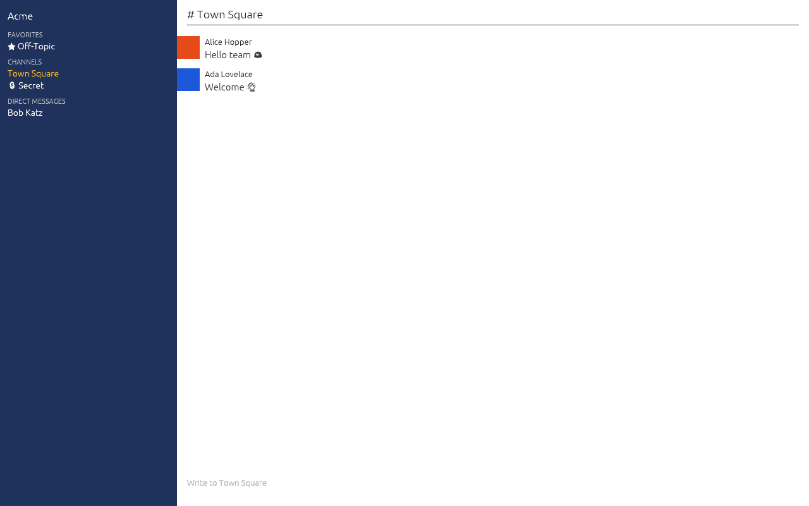

# ComPort

Native Mattermost desktop client. Pure Rust, Blade + egui + winit. Not a webview
wrapper.



This is the third [navigato-rs](https://github.com/navigato-rs) app, after
[FileMan](https://github.com/navigato-rs/fileman) and
[Starcom](https://github.com/navigato-rs/starcom). Architecture lives in
[`DESIGN.md`](DESIGN.md).

## Connect to your Mattermost

ComPort talks to a **self-hosted or Mattermost Cloud** server over HTTPS. There
is no ComPort account and no extra service to install on the server.

1. **Site URL** — the same address you open in a browser, including any
   subpath. Examples: `https://chat.company.com`,
   `https://mattermost.company.com/team`. Type it with `https://`, or a hostname
   (`chat.company.com`) and ComPort will use HTTPS.
2. **Sign in with browser** — the usual path when the server uses SAML, GitLab,
   Google, Entra ID, or OpenID, and when password login is turned off. ComPort
   opens that page in your system browser. After you sign in, Mattermost
   redirects to `mattermost://…?server_token=…`. ComPort exchanges that
   one-time token for a session. It does not embed the login page, and it does
   not need a personal access token (that setting is often absent).
3. If the browser asks which app to open, pick ComPort. If the official
   Mattermost desktop app is already the `mattermost://` handler, it will take
   the link instead. Cancel that prompt and paste the page address into
   ComPort. `make install` registers `comport://` always, and `mattermost://`
   only when nothing else claims it.
4. **Password, MFA, or a personal access token** are under “Password or token”
   for servers that still allow them.
5. Run:

```sh
cargo run --locked -- --server https://chat.company.com
```

or `cargo run --locked` and use **Sign in with browser**. The last Site URL is
remembered under your config dir (`~/.config/comport` on Linux). The session
token stays in memory for this version (not written to disk). Closing the app
means signing in again. The lower-left indicator is **Live** while the
websocket is up and **Updated** when a post arrives. ComPort does not poll.

While you are signed in you can read rooms, send, edit, and delete your posts.
Mention counts show on the room. If you belong to more than one team, click
the team name to switch.

TLS uses the OS trust store and the experimental rustls-rustcrypto provider
(same bet as FileMan’s evaluation client). Corporate MITM proxies that require
a custom CA must be in the OS trust store.

## Demo (no server)

```sh
cargo run --locked -- --demo
cargo run --locked -- --demo --snapshot /tmp/comport.png
```

## Build

```sh
cargo test --locked --all-features --all-targets
cargo clippy --locked --all-features --all-targets -- -D warnings
python3 scripts/check-dependencies.py
```

On Linux, `make install` puts the binary, `.desktop` entry, and icon under
`~/.local`.

## Privacy

No automatic uploads. See [`PRIVACY.md`](PRIVACY.md).
